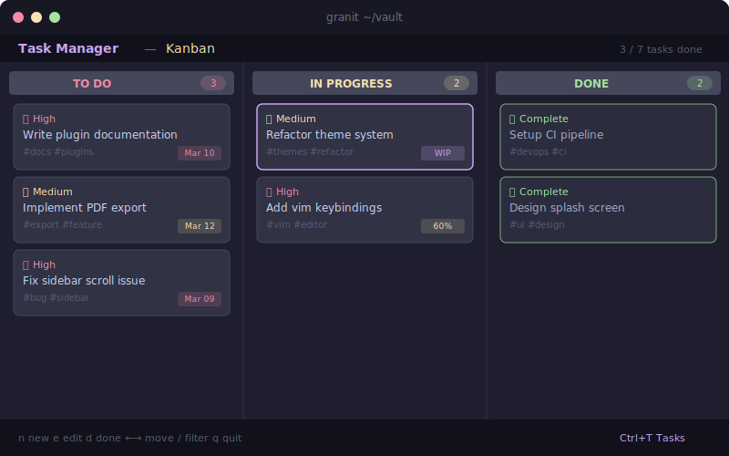
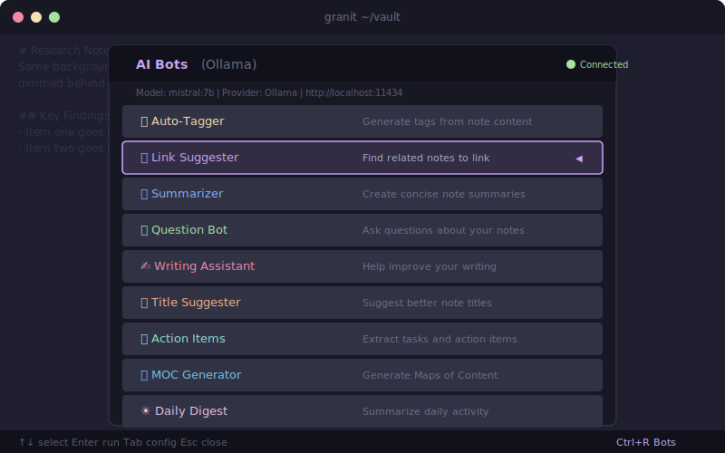
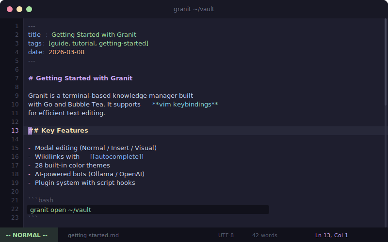
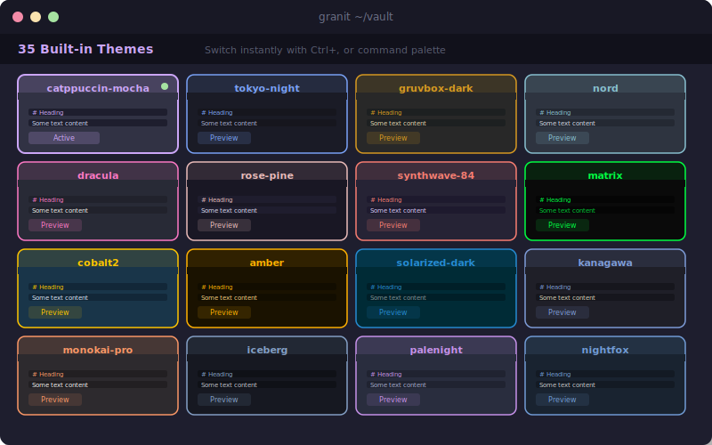
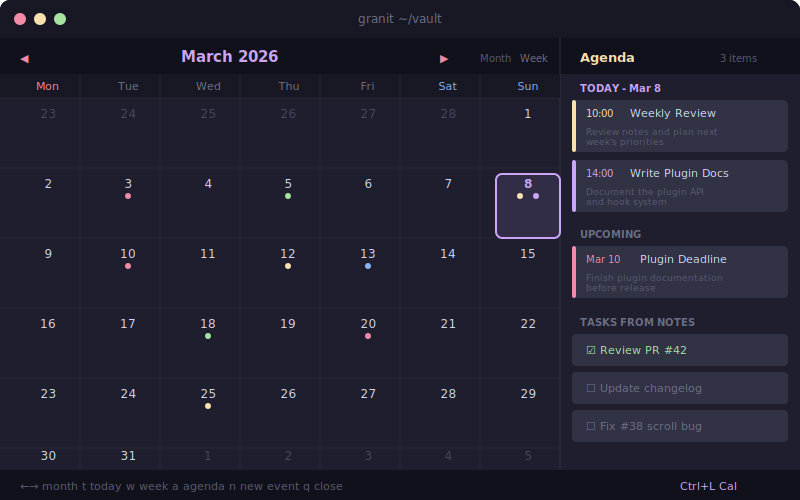
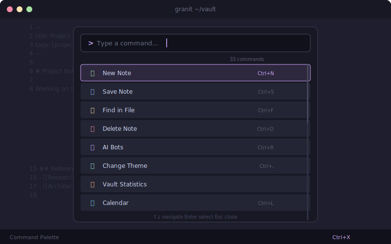

<p align="center">
  <pre align="center">
   ██████╗ ██████╗  █████╗ ███╗   ██╗██╗████████╗
  ██╔════╝ ██╔══██╗██╔══██╗████╗  ██║██║╚══██╔══╝
  ██║  ███╗██████╔╝███████║██╔██╗ ██║██║   ██║
  ██║   ██║██╔══██╗██╔══██║██║╚██╗██║██║   ██║
  ╚██████╔╝██║  ██║██║  ██║██║ ╚████║██║   ██║
   ╚═════╝ ╚═╝  ╚═╝╚═╝  ╚═╝╚═╝  ╚═══╝╚═╝   ╚═╝
  </pre>
</p>

<p align="center">
  <strong>A blazing-fast, AI-powered terminal knowledge manager — fully Obsidian compatible</strong>
</p>

<p align="center">
  <a href="#installation"></a>
  <a href="LICENSE"></a>
  
  
  
  
</p>

<p align="center">
  <a href="#features">Features</a> &bull;
  <a href="#installation">Installation</a> &bull;
  <a href="#quick-start">Quick Start</a> &bull;
  <a href="#ai-features">AI Features</a> &bull;
  <a href="#keyboard-shortcuts">Shortcuts</a> &bull;
  <a href="#configuration">Config</a> &bull;
  <a href="#themes">Themes</a> &bull;
  <a href="#architecture">Architecture</a> &bull;
  <a href="docs/">Documentation</a> &bull;
  <a href="#contributing">Contributing</a>
</p>

<p align="center">
  
  <br>
  <sub>Recorded with <a href="https://github.com/charmbracelet/vhs">VHS</a> &mdash; see <code>tapes/</code> for source scripts. Fallback: <a href="assets/editor.gif">assets/editor.gif</a></sub>
</p>

---

Granit is a **free, open-source** terminal-native personal knowledge management system built in Go. It reads and writes standard Markdown with YAML frontmatter and `[[wikilinks]]`, so your vault stays **fully compatible** with Obsidian, Logseq, and any other Markdown-based tool.

**No Electron. No browser. No subscriptions. Just your terminal.**

> **Why Granit?** Obsidian is great, but it's Electron-based, closed-source, and its AI features require a paid subscription. Granit gives you a fast, keyboard-driven alternative with **built-in AI** (local or cloud), **Vim keybindings**, **Git integration**, and **100+ features** — all running natively in your terminal at a fraction of the memory footprint.

### At a Glance

| | |
|---|---|
| **110+ source files** | 85,000+ lines of Go powering the TUI |
| **35 themes** | 29 dark + 6 light, plus custom theme editor |
| **20+ AI features** | Ollama, OpenAI, Claude Code, or offline fallback |
| **8 layouts** | Default, Writer, Minimal, Reading, Dashboard, Zen, Taskboard, Research |
| **16 core plugins** | Enable/disable modules individually |
| **Full Vim mode** | Normal, Insert, Visual, Command — dot repeat + macro recording |
| **400+ tests** | Unit, integration, stress, edge case, and benchmark tests |
| **Obsidian compatible** | `[[wikilinks]]`, YAML frontmatter, same folder structure |
| **Zero telemetry** | Your data stays local. Always. |

---

## Screenshots

<table>
<tr>
<td align="center"><strong>Splash Screen</strong></td>
<td align="center"><strong>Rendered View Mode</strong></td>
</tr>
<tr>
<td></td>
<td></td>
</tr>
<tr>
<td align="center"><strong>3-Panel Editor Layout</strong></td>
<td align="center"><strong>Launch Animation</strong></td>
</tr>
<tr>
<td></td>
<td></td>
</tr>
</table>

### Feature Showcase

<table>
<tr>
<td align="center"><strong>Task Manager (Kanban + Calendar)</strong></td>
<td align="center"><strong>AI Bots (9 Assistants)</strong></td>
</tr>
<tr>
<td></td>
<td></td>
</tr>
<tr>
<td align="center"><strong>Vim Mode (Full Modal Editing)</strong></td>
<td align="center"><strong>35 Built-in Themes</strong></td>
</tr>
<tr>
<td></td>
<td></td>
</tr>
<tr>
<td align="center"><strong>Calendar (Month/Week/Year/Agenda)</strong></td>
<td align="center"><strong>Command Palette (70+ Commands)</strong></td>
</tr>
<tr>
<td></td>
<td></td>
</tr>
</table>

---

## Features

Granit ships with **100+ features** across 8 categories. For the full breakdown, see the [Feature Guide](docs/FEATURES.md).

### Core Editor

- **Syntax-highlighted Markdown** with language-aware code blocks (Go, Python, JS/TS, Rust, Shell)
- **Vim keybindings** — full modal editing: Normal/Insert/Visual/Command with `hjkl`, `dd`/`yy`/`p`, `:w`/`:q`, dot repeat
- **Multi-cursor editing** — `Ctrl+D` to add cursors at next occurrence; `Ctrl+Shift+Up/Down` for column cursors
- **Heading folding** — collapse/expand sections by heading level; fold indicators in gutter; `za`/`zM`/`zR` vim bindings and `Alt+F`
- **Visual table editor** — edit Markdown tables in a spreadsheet-like interface with scrolling, insert mode, and new table creation
- **Wikilinks** with `[[` autocomplete popup, fuzzy search, and preview snippets
- **Backlinks panel** and live **note preview popup** on hover
- **YAML frontmatter** parsing + structured **frontmatter editor** (tags as pills, booleans as toggles)
- **Rendered view mode** (`Ctrl+E`) with styled Markdown, Mermaid diagrams, and custom diagram blocks
- **Find & Replace** in-file (`Ctrl+F`/`Ctrl+H`) and **global search & replace** across all vault files
- **Ghost Writer** — inline AI writing suggestions (Tab to accept)
- **18 built-in snippets** (`/date`, `/todo`, `/meeting`, `/table`, and more)
- **Note encryption** — AES-256-GCM with PBKDF2 for secure GitHub sync
- **Mermaid diagrams** — flowcharts, sequence, pie, class, Gantt as ASCII art
- **Custom diagram engine** — 6 types: sequence, tree, movement, timeline, comparison, figure (10 pre-drawn fighting technique illustrations)
- **Link assistant** — find unlinked mentions and batch-create wikilinks
- **Spell checking**, auto-close brackets, smart indentation, line numbers

### AI-Powered Features

Granit includes **20+ AI features** that work with local models (Ollama), OpenAI, Claude Code, or a zero-setup offline fallback. See the [AI Guide](docs/AI-GUIDE.md) for setup.

| Feature | Shortcut | Description |
|---------|----------|-------------|
| **9 AI Bots** | `Ctrl+R` | Auto-Tagger, Link Suggester, Summarizer, Q&A, Writing Assistant, Title Suggester, Action Items, MOC Generator, Daily Digest |
| **AI Chat** | Command palette | Ask questions about your entire vault with context-aware answers |
| **Chat with Note** | Command palette | AI Q&A focused on the current note |
| **AI Compose** | Command palette | Generate full notes from a topic prompt |
| **Ghost Writer** | Settings toggle | Inline writing suggestions as you type (Tab to accept) |
| **Thread Weaver** | Command palette | Synthesize multiple notes into a new essay or summary |
| **Semantic Search** | Command palette | Meaning-based vault search using AI embeddings |
| **Knowledge Graph AI** | Command palette | Analyze clusters, hubs, orphans, and get link suggestions |
| **Auto-Link** | Command palette | Find unlinked mentions of note titles |
| **Auto-Tag** | Settings toggle | Automatically suggest tags on save |
| **Smart Connections** | Command palette | TF-IDF cosine similarity to find related notes |
| **AI Templates** | Command palette | 9 template types with AI generation |
| **Deep Dive Research** | Command palette | Multi-note research via Claude Code — 4 profiles, 4 source filters |
| **Vault Analyzer** | Command palette | AI analysis of vault structure and gaps via Claude Code |
| **Note Enhancer** | Command palette | AI-enhance notes with links and deeper content via Claude Code |
| **Daily Digest** | Command palette | Weekly review from recent vault activity via Claude Code |
| **NL Search** | Command palette | Natural language vault search ("find notes about...") |
| **AI Writing Coach** | Command palette | Clarity/structure/style analysis with soul note persona support |
| **AI Smart Scheduler** | Command palette | AI-powered optimal daily schedule generation |
| **Vault Refactor** | Command palette | AI suggestions to reorganize, merge, or retag notes |
| **Daily Briefing** | Command palette | AI morning summary of notes, tasks, and connections |
| **Quiz Mode** | Command palette | Auto-generated quizzes from your notes for active recall |
| **Flashcards** | Command palette | Spaced repetition (SM-2 algorithm) from your notes |
| **Learning Dashboard** | Command palette | Track study progress, streaks, and mastery |

### Vault Management

- **Multi-vault switcher** — switch between vaults without restarting
- **Vault selector** — pick from recent vaults or create new ones at launch
- **File tree sidebar** with folder collapse/expand and fuzzy search (`Ctrl+P`)
- **Full-text search** across all note contents with highlighted results
- **Tag browser** (`Ctrl+T`) — browse and filter notes by tag
- **Graph view** (`Ctrl+G`) — visualize note connections
- **Note outline** (`Ctrl+O`) — heading-based document structure
- **Bookmarks & recents** (`Ctrl+B`) — star notes and jump to recently opened files
- **Quick switch** (`Ctrl+J`) — fast file switching
- **Breadcrumb navigation** — folder path above the editor with click navigation
- **Daily notes** — create or open today's note with a single command
- **Vault statistics** — note counts, link density, word counts, activity charts
- **Trash** — soft-delete with restore from `.granit-trash/`
- **File watcher** — auto-detects external changes and refreshes
- **Lazy vault loading** — on-demand reading for fast startup with 1000+ notes
- **Workspace layouts** — save and restore named workspace snapshots

### Task Management & Productivity

| Feature | Access | Description |
|---------|--------|-------------|
| **Task Manager** | `Ctrl+K` | 6 views (Today, Upcoming, All, Done, Calendar, Kanban), 5 priority levels, date picker, cross-vault scanning |
| **Daily Planner** | Command palette | Time-blocked daily schedule (6am–10pm, 30-min slots) with task/event/habit import |
| **AI Smart Scheduler** | Command palette | Auto-generate optimal daily schedules based on priorities and estimated times |
| **Recurring Tasks** | Command palette | Daily/weekly/monthly auto-creating tasks |
| **Pomodoro Timer** | Command palette | 25-min focus sessions with break cycles |
| **Focus Sessions** | Command palette | Guided work timer (25/45/60/90 min) with goal, scratchpad, and session log |
| **Time Tracker** | Command palette | Per-note/task time tracking with pomodoro counting and reports |
| **Habit & Goal Tracker** | Command palette | Daily habits with 7-day streaks, goals with milestones and progress bars |
| **Daily Standup** | Command palette | Auto-generate standup from git commits, modified notes, and completed tasks |
| **Quick Capture** | Command palette | Compact floating input for rapid thought capture to Inbox, daily note, or Tasks |
| **Journal Prompts** | Command palette | 100+ curated prompts across 8 categories with guided write mode |
| **Clipboard Manager** | Command palette | 50-entry clipboard history with search, pin, preview, and paste |
| **Floating Scratchpad** | Command palette | Persistent scratch area that survives across notes and sessions |

### Knowledge & Analytics

- **Smart Connections** — TF-IDF content similarity finds semantically related notes with shared keyword display
- **Writing Statistics** — word counts, 14-day activity chart, writing streaks, top notes by length
- **Mind Map View** — ASCII mind map from note headings and wikilinks (two modes: headings + links)
- **Dataview Queries** — query notes by frontmatter properties with interactive builder (filters, sort, table/list)
- **Note Versioning Timeline** — git history per note with colored diff viewer and snapshot restore
- **Note Preview Popup** — floating preview of linked notes with scroll and formatting
- **Vault Dashboard** — home screen with today's tasks, recent notes, vault stats, activity chart
- **Enhanced Calendar** (`Ctrl+L`) — month/week/year view, 14-day agenda, task badges, quick event add
- **Project Mode** — project management with 9 categories, dashboards, completion stats

### Language Learning

- **Vocabulary tracker** with 9 languages and spaced repetition practice
- **Grammar notes** with templates
- **Progress dashboard** with streak tracking and level distribution charts
- Stores everything in `Languages/` folder as Markdown

### Git Integration

Built-in git overlay with status, log, and diff views:

- **Status** — modified, added, deleted, and untracked files
- **Log** — recent commit history with colored hashes
- **Diff** — syntax-highlighted diff of unstaged changes
- Quick actions: **commit** (c), **push** (p), **pull** (P), **refresh** (r)
- **Auto-sync** — optional auto commit+push on save, pull on open
- **Per-note git history** — view commit history, browse colored diffs, restore previous versions

### Export & Publishing

- **Export to HTML** — styled document with CSS
- **Export to Plain Text** — Markdown stripped to plain text
- **Export to PDF** — via pandoc (if installed)
- **Bulk HTML export** — all vault notes at once
- **Static site publisher** — export vault as a complete HTML website with search, tag pages, and wikilink resolution
- **Blog publisher** — publish to **Medium** (draft/public/unlisted) or **GitHub** (push to any repo/branch) with persistent token storage and retry logic

### Extensibility

- **Plugin system** — language-agnostic scripts with JSON manifests and 6 lifecycle hooks. See [Plugin Guide](docs/PLUGINS.md).
- **Lua scripting** — full API access (`granit.read_note`, `granit.write_note`, etc.)
- **Core plugins** — enable/disable 16 built-in modules individually via Settings > Core Plugins
- **Dataview queries** — embed live queries in notes using `query` code blocks
- **Obsidian import** — import settings from existing `.obsidian/` directories
- **Canvas / Whiteboard** (`Ctrl+W`) — visual note arrangement with connections and colors
- **Split panes** — view two notes side by side

### 35 Themes, Custom Themes & 4 Icon Sets

Instantly switch between **29 dark** and **6 light** built-in themes from settings. Create your own with the **Theme Editor** — live-edit all 16 color roles with hex values, preview changes instantly, and save/export custom themes as JSON. Choose from **Unicode**, **Nerd Font**, **Emoji**, or **ASCII** icon sets. See all themes in the [Theme Reference](docs/THEMES.md).

### 8 Panel Layouts

| Layout | Panels | Description |
|--------|--------|-------------|
| **Default** | 3 | Sidebar + editor + backlinks |
| **Writer** | 2 | Sidebar + editor |
| **Minimal** | 1 | Editor only |
| **Reading** | 2 | Editor + backlinks (wide reading) |
| **Dashboard** | 4 | Sidebar + editor + outline + backlinks |
| **Zen** | 1 | Centered editor, 80-char max, no chrome |
| **Taskboard** | 3 | Sidebar + editor + task summary |
| **Research** | 3 | Sidebar + editor + notes/backlinks panel |

### Image Manager

Browse, preview, insert, and delete images in your vault. Terminal preview uses half-block character rendering for truecolor terminals.

### 10+ Note Templates

Create notes from built-in templates: Standard, Meeting Notes, Project Plan, Weekly Review, Book Notes, Decision Record, Journal Entry, Research Note, Learning/Zettelkasten, and more. **User-defined templates** — drop `.md` files into your vault's `templates/` folder and they appear alongside built-in templates.

---

## Installation

### Requirements

- **Go 1.23+** ([install Go](https://go.dev/doc/install))
- **Git** (for cloning and git features)
- Linux or macOS (Windows support planned)

For detailed instructions, see the [Installation Guide](docs/INSTALLATION.md).

### Quick Install (Recommended)

```bash
git clone https://github.com/artaeon/granit.git
cd granit
go install ./cmd/granit/
```

This installs the `granit` binary to `~/go/bin/`. Make sure it's in your PATH:

```bash
# Add to ~/.bashrc or ~/.zshrc (one-time setup):
export PATH="$HOME/go/bin:$PATH"
```

### Arch Linux (AUR)

```bash
# Stable release
yay -S granit

# Latest git
yay -S granit-git
```

### System-wide Install

```bash
git clone https://github.com/artaeon/granit.git
cd granit
go build -o granit ./cmd/granit
sudo mv granit /usr/local/bin/
```

### Go Install (Remote)

```bash
go install github.com/artaeon/granit/cmd/granit@latest
```

### Updating

```bash
cd granit
git pull
go install ./cmd/granit/
```

### Optional Dependencies

| Tool | Purpose | Required? |
|------|---------|-----------|
| **Ollama** | Local AI (recommended) | No — local fallback works offline |
| **aspell** or **hunspell** | Spell checking | No |
| **pandoc** | PDF export | No |
| **xclip**, **xsel**, or **wl-copy** | System clipboard (Linux) | No — degrades gracefully |
| **Claude Code** | Deep Dive AI research agent | No — only for research feature |
| **Git** | Version control features | No — git features are optional |

---

## Quick Start

```bash
# Open the vault selector (pick from recent vaults or create new):
granit

# Open a specific vault:
granit ~/Notes

# Open with explicit command:
granit open ~/Notes

# Create/open today's daily note:
granit daily ~/Notes

# Scan a vault and print stats:
granit scan ~/Notes

# List all known vaults:
granit list

# Show configuration paths and values:
granit config

# View the man page:
granit man | man -l -

# Print version:
granit version
```

### Try the Demo Vault

Granit ships with a demo vault showcasing all major features — 18 interconnected notes with wikilinks, tasks, code blocks, Mermaid diagrams, and project management:

```bash
granit demo-vault
```

### First Steps

1. Run `granit` in any directory with `.md` files — or create a new vault from the selector.
2. Use `Tab` or `F1`/`F2`/`F3` to switch between sidebar, editor, and backlinks.
3. Press `Ctrl+N` to create a new note (pick from 10+ templates).
4. Type `[[` in the editor to start a wikilink — autocomplete suggests matching notes.
5. Press `Ctrl+E` to toggle between edit and rendered view mode.
6. Press `Ctrl+S` to save. Enable auto-save in settings (`Ctrl+,`).
7. Press `Ctrl+X` to open the **command palette** — access all 70+ commands from one place.
8. Press `Ctrl+K` to open the **task manager** — manage tasks with Kanban board and priorities.
9. Press `Ctrl+1`–`Ctrl+9` to switch between open tabs. Tabs persist across sessions.

---

## AI Features

Granit supports three AI providers. The **local** provider works out of the box with no setup. For the full guide, see [AI Guide](docs/AI-GUIDE.md).

### Ollama (Recommended for Local AI)

Granit includes a **built-in setup wizard**. Open settings (`Ctrl+,`), select **"Setup Ollama"**, and press Enter. The wizard installs Ollama and pulls your chosen model automatically.

Or set up manually:

```bash
# Install Ollama
curl -fsSL https://ollama.ai/install.sh | sh

# Pull a model
ollama pull qwen2.5:0.5b

# Start the server
ollama serve
```

#### Model Recommendations

| RAM | Model | Quality |
|-----|-------|---------|
| 4 GB | `qwen2.5:0.5b` | Fast, lightweight |
| 8 GB | `qwen2.5:1.5b` or `phi3:mini` | Good balance |
| 16 GB | `qwen2.5:3b` or `phi3.5:3.8b` | High quality |
| 32 GB+ | `llama3.2` or `mistral` | Best quality |

When Granit exits, it automatically unloads the Ollama model to free memory.

### OpenAI

```json
{
  "ai_provider": "openai",
  "openai_key": "sk-...",
  "openai_model": "gpt-4o-mini"
}
```

Available models: `gpt-4o-mini`, `gpt-4o`, `gpt-4.1-mini`, `gpt-4.1-nano`.

### Claude Code (Deep Dive Research)

The **Deep Dive Research** feature uses [Claude Code](https://docs.anthropic.com/en/docs/claude-code) as an AI-powered research agent. It searches the web, creates 5–25 interconnected notes in a `Research/` folder with a hub index note, adds frontmatter/tags/wikilinks automatically. Three output formats: **Zettelkasten**, **Outline**, or **Study Guide**. Research runs in the background with a live status indicator.

Advanced integration:
- **CLAUDE.md awareness** — project context loaded into all research prompts
- **Soul note persona** — `.granit/soul-note.md` shapes the research writing tone
- **10-minute timeout** with Esc cancellation
- **4 research profiles**: General, Academic, Technical, Creative
- **4 source filters**: Any, Web, Docs, Papers

**Requires**: Claude Code installed and authenticated (`claude` in PATH).

### Local Fallback

The default `"local"` provider uses keyword matching, stopword filtering, and topic detection — no network calls, no API keys, works offline.

---

## Keyboard Shortcuts

For the complete reference, see [Keybindings Guide](docs/KEYBINDINGS.md).

### Navigation

| Key | Action |
|-----|--------|
| `Tab` / `Shift+Tab` | Cycle between panels |
| `F1` / `F2` / `F3` | Focus sidebar / editor / backlinks |
| `Alt+Left` / `Alt+Right` | Navigate back / forward in history |
| `Esc` | Return to sidebar / close overlay |
| `j` / `k` / Arrows | Navigate up/down |
| `Enter` | Open selected file or link |

### File Operations

| Key | Action |
|-----|--------|
| `Ctrl+P` | Quick open (fuzzy search) |
| `Ctrl+N` | Create new note (template picker) |
| `Ctrl+S` | Save current note |
| `Ctrl+V` | Paste from system clipboard |
| `F4` | Rename current note |
| `Ctrl+X` | Command palette (all commands) |

### Editor

| Key | Action |
|-----|--------|
| `Ctrl+E` | Toggle view/edit mode |
| `Ctrl+U` / `Ctrl+Y` | Undo / Redo |
| `Ctrl+F` | Find in file |
| `Ctrl+H` | Find and replace |
| `Ctrl+D` | Select word / multi-cursor |
| `Ctrl+K` | Task manager |
| `Alt+F` | Toggle fold at cursor |
| `[[` | Trigger wikilink autocomplete |
| `Tab` | Accept ghost writer suggestion / indent |

### Views & Tools

| Key | Action |
|-----|--------|
| `Ctrl+G` | Note graph |
| `Ctrl+T` | Tag browser |
| `Ctrl+O` | Note outline |
| `Ctrl+B` | Bookmarks & recent |
| `Ctrl+J` | Quick switch files |
| `Ctrl+W` | Canvas / whiteboard |
| `Ctrl+L` | Calendar view |
| `Ctrl+R` | AI bots |
| `Ctrl+Z` | Focus / zen mode |
| `Ctrl+,` | Settings |
| `F5` | Help / keyboard shortcuts |
| `Ctrl+Q` | Quit |

### Vim Mode

When enabled (settings or command palette), the editor uses full modal keybindings:

| Mode | Keys |
|------|------|
| **Normal** | `h`/`j`/`k`/`l`, `w`/`b`/`e`, `0`/`$`, `gg`/`G`, `dd`/`yy`/`p`, `u`/`Ctrl+R`, `i`/`a`/`o`/`O`, `.` repeat, `za`/`zM`/`zR` fold |
| **Insert** | All keys pass through; `Esc` returns to Normal |
| **Visual** | Movement extends selection; `d` deletes, `y` yanks |
| **Command** | `:w` save, `:q` quit, `:wq` save+quit, `:{n}` go to line |
| **Macros** | `q`+register to record, `q` to stop, `@`+register to replay, `@@` for last |

---

## Configuration

Granit uses a layered JSON config. For all options, see the [Configuration Reference](docs/CONFIGURATION.md).

| Scope | Path |
|-------|------|
| Global | `~/.config/granit/config.json` |
| Per-vault | `<vault>/.granit.json` |
| Vault list | `~/.config/granit/vaults.json` |

Per-vault settings override global. All settings can be changed from the built-in settings panel (`Ctrl+,`).

<details>
<summary><strong>All Configuration Options</strong></summary>

```json
{
  "editor": {
    "tab_size": 4,
    "insert_tabs": false,
    "auto_indent": true
  },
  "theme": "catppuccin-mocha",
  "icon_theme": "unicode",
  "layout": "default",
  "sidebar_position": "left",
  "show_icons": true,
  "show_help": true,
  "show_splash": true,
  "compact_mode": false,
  "line_numbers": true,
  "word_wrap": false,
  "highlight_current_line": true,
  "auto_close_brackets": true,
  "auto_save": false,
  "auto_refresh": true,
  "confirm_delete": true,
  "default_view_mode": false,
  "vim_mode": false,
  "ghost_writer": false,
  "auto_tag": false,
  "daily_notes_folder": "",
  "daily_note_template": "",
  "git_auto_sync": false,
  "ai_provider": "local",
  "ollama_model": "qwen2.5:0.5b",
  "ollama_url": "http://localhost:11434",
  "openai_key": "",
  "openai_model": "gpt-4o-mini"
}
```

| Option | Default | Description |
|--------|---------|-------------|
| `theme` | `catppuccin-mocha` | Color theme (35 available) |
| `icon_theme` | `unicode` | `unicode`, `nerd`, `emoji`, or `ascii` |
| `layout` | `default` | `default`, `writer`, `minimal`, `reading`, `dashboard`, `zen`, `taskboard`, `research` |
| `vim_mode` | `false` | Enable Vim-style modal editing |
| `ghost_writer` | `false` | Enable inline AI writing suggestions |
| `auto_tag` | `false` | Auto-suggest tags on save |
| `git_auto_sync` | `false` | Auto commit+push on save, pull on open |
| `ai_provider` | `local` | `local`, `ollama`, or `openai` |

</details>

---

## Themes

### Dark Themes (29)

| Theme | Description |
|-------|-------------|
| `catppuccin-mocha` | Warm, pastel dark (default) |
| `catppuccin-frappe` | Mid-tone Catppuccin |
| `catppuccin-macchiato` | Deep Catppuccin |
| `tokyo-night` | Inspired by Tokyo at night |
| `gruvbox-dark` | Retro, earthy warm tones |
| `nord` | Arctic, cool blue palette |
| `dracula` | Classic dark with vivid accents |
| `solarized-dark` | Ethan Schoonover's dark palette |
| `rose-pine` | Muted, elegant dark |
| `everforest-dark` | Nature-inspired greens |
| `kanagawa` | Inspired by Hokusai |
| `one-dark` | Atom's iconic dark theme |
| `github-dark` | GitHub dark mode |
| `ayu-dark` | Minimal, deep dark |
| `palenight` | Material Design dark |
| `synthwave-84` | Neon retro synthwave |
| `nightfox` | Cool, refined dark |
| `vesper` | Warm amber on deep brown |
| `poimandres` | Cool teal and pastels |
| `moonlight` | Soft blue-purple moonlit |
| `vitesse-dark` | Minimal, modern green |
| `oxocarbon` | IBM Carbon-inspired |
| `matrix` | Green on black hacker aesthetic |
| `cobalt2` | Deep blue with gold accents |
| `monokai-pro` | Warm dark with vivid syntax colors |
| `horizon` | Purple and teal gradients |
| `zenburn` | Low-contrast earthy tones |
| `iceberg` | Cool blue-gray and frost |
| `amber` | Retro CRT amber monochrome |

### Light Themes (6)

| Theme | Description |
|-------|-------------|
| `catppuccin-latte` | Warm, pastel light |
| `solarized-light` | Ethan Schoonover's light |
| `rose-pine-dawn` | Elegant, warm light |
| `github-light` | GitHub light mode |
| `ayu-light` | Clean, bright light |
| `min-light` | Ultra-minimal bright |

Create custom themes with the built-in **Theme Editor** — live-edit 16 color roles and export as JSON.

---

## Architecture

```
granit/
  cmd/granit/
    main.go                 CLI entry point, vault selector, subcommands
    manpage.go              Roff man page generator (granit man)
  internal/
    config/
      config.go             JSON configuration (global + per-vault)
      vaults.go             Vault list persistence
      import.go             Obsidian config importer
    vault/
      vault.go              Vault scanning with lazy loading
      parser.go             Markdown/frontmatter/wikilink parser
      index.go              Backlink and link index
    tui/                    109 source files, 80k+ lines
      app.go                Main Bubble Tea model
      editor.go             Text editor with multi-cursor
      syntaxhl.go           Language-aware code block highlighting
      renderer.go           Markdown rendering for view mode
      sidebar.go            File tree sidebar
      statusbar.go          Status bar with AI, pomodoro, and task indicators
      styles.go             Global style definitions
      themes.go             35 built-in color themes
      customtheme.go        Custom theme JSON loading/saving
      themeeditor.go        Live theme editor overlay
      layouts.go            8 panel layout definitions
      command.go            Command palette (70+ actions)
      vim.go                Vim modal editing
      folding.go            Collapsible heading/code fold state
      footnotes.go          Footnote parsing and rendering
      encryption.go         AES-256-GCM note encryption
      frontmatteredit.go    Structured frontmatter property editor
      backlinkpreview.go    Live wikilink hover preview
      githistory.go         Per-note git history with diff/restore
      workspace.go          Named workspace layout persistence
      timeline.go           Chronological note timeline
      vaultswitch.go        In-app multi-vault switcher
      vaultselector.go      Vault selector full-screen UI
      bots.go               AI bot system (9 bots)
      aichat.go             Vault-wide AI chat
      composer.go           AI note composer
      ghostwriter.go        Inline AI writing suggestions
      threadweaver.go       Multi-note AI synthesis
      autotag.go            Auto-tagger + note chat
      embeddings.go         Semantic search with AI embeddings
      knowledgegraph.go     Knowledge graph analysis
      vaultrefactor.go      AI vault reorganization
      dailybriefing.go      AI morning briefing generator
      similarity.go         TF-IDF note similarity
      tableeditor.go        Visual markdown table editor
      mermaid.go            Mermaid diagram ASCII renderer
      flashcards.go         Spaced repetition (SM-2)
      quizmode.go           Auto-generated quizzes
      learndash.go          Learning dashboard
      git.go                Git integration overlay
      export.go             Note export (HTML, text, PDF)
      publish.go            Static site publisher
      plugins.go            Plugin system + registry
      lua.go                Lua scripting engine
      calendar.go           Calendar view (month/week/agenda)
      canvas.go             Visual whiteboard
      contentsearch.go      Full-text vault search
      imageview.go          Image manager + terminal preview
      research.go           Deep Dive AI research + vault analyzer + note enhancer + daily digest
      aitemplates.go        AI template generator (9 types)
      languagelearn.go      Language learning (vocabulary, practice, grammar)
      habits.go             Habit & goal tracker
      focussession.go       Focus sessions (timer, scratchpad, log)
      standup.go            Daily standup generator
      notehistory.go        Note versioning timeline
      smartconnect.go       Smart connections (TF-IDF similarity)
      writingstats.go       Writing statistics
      quickcapture.go       Quick capture (floating input)
      dashboard.go          Vault dashboard home screen
      mindmap.go            Mind map view (ASCII tree)
      journalprompts.go     Daily journal prompts (100+ prompts)
      clipmanager.go        Clipboard manager (50-entry history)
      dailyplanner.go       Daily planner (time-blocked schedule)
      aischeduler.go        AI smart scheduler
      recurringtasks.go     Recurring tasks (auto-creation)
      notepreview.go        Note preview popup
      scratchpad.go         Floating scratchpad
      projectmode.go        Project mode (categories, dashboards)
      nlsearch.go           Natural language search
      writingcoach.go       AI writing coach
      dataview.go           Dataview queries
      timetracker.go        Time tracker + pomodoro stats
      taskmanager.go        Task manager (kanban, calendar, priorities)
      linkassist.go         Unlinked mention finder
      blogpublish.go        Blog publisher (Medium + GitHub)
      breadcrumb.go         Breadcrumb navigation + pinned tabs
      diagrams.go           Custom diagram engine (6 types)
      globalreplace.go      Global search & replace
      ... and more
  .github/
    workflows/
      ci.yml                Build + vet + test on every push/PR
      release.yml           GoReleaser on tag push (v*)
      auto-release.yml      Auto-tag and release on main push
```

Built on [Bubble Tea](https://github.com/charmbracelet/bubbletea) and [Lip Gloss](https://github.com/charmbracelet/lipgloss) by [Charm](https://charm.sh/). For the full technical overview, see [Architecture Guide](docs/ARCHITECTURE.md).

---

## Contributing

Contributions are welcome! Granit is free and open-source software.

### Build & Run

```bash
git clone https://github.com/artaeon/granit.git
cd granit
go build -o granit ./cmd/granit
./granit ~/your-vault
```

### Development Guidelines

- All TUI components live in `internal/tui/` and follow Bubble Tea's `Model`/`Update`/`View` pattern
- Overlays use value receivers for `Update` and `View`, helper components use pointer receivers
- Configuration goes in `internal/config/config.go` + `internal/tui/settings.go`
- Themes are `Theme` structs in `internal/tui/themes.go`
- Keep dependencies minimal (currently: Bubble Tea, Lip Gloss, GopherLua)
- See the [Architecture Guide](docs/ARCHITECTURE.md) for detailed conventions

### Submitting Changes

1. Fork the repository and create a feature branch
2. Make your changes and verify `go build ./...` and `go vet ./...` pass
3. Open a pull request with a clear description

### Reporting Issues

Found a bug or have a feature request? [Open an issue](https://github.com/artaeon/granit/issues).

---

## Documentation

| Document | Description |
|----------|-------------|
| [Feature Guide](docs/FEATURES.md) | Exhaustive feature reference with usage instructions |
| [Installation Guide](docs/INSTALLATION.md) | Detailed installation for all platforms |
| [AI Guide](docs/AI-GUIDE.md) | AI provider setup and feature documentation |
| [Keybindings](docs/KEYBINDINGS.md) | Complete keyboard shortcut reference |
| [Architecture](docs/ARCHITECTURE.md) | Technical overview and codebase structure |
| [Configuration](docs/CONFIGURATION.md) | All config options with defaults |
| [Plugin Guide](docs/PLUGINS.md) | Plugin development and Lua scripting |
| [Theme Reference](docs/THEMES.md) | All 35 themes and custom theme creation |
| [Changelog](CHANGELOG.md) | Version history and release notes |

---

## License

Granit is released under the [MIT License](LICENSE). Free to use, modify, and distribute.

---

## Acknowledgments

- [Bubble Tea](https://github.com/charmbracelet/bubbletea) & [Lip Gloss](https://github.com/charmbracelet/lipgloss) — the terminal UI framework
- [Charm](https://charm.sh/) — the team behind the Go terminal ecosystem
- [Obsidian](https://obsidian.md/) — inspiration for vault-based knowledge management
- [Catppuccin](https://github.com/catppuccin/catppuccin) — the default color palette
- [GopherLua](https://github.com/yuin/gopher-lua) — Lua scripting support

---

<p align="center">
  <strong>Granit</strong> — your knowledge, your terminal, your rules.<br>
  <sub>Free and open source. No telemetry. No subscriptions. Your data stays local.</sub>
</p>
