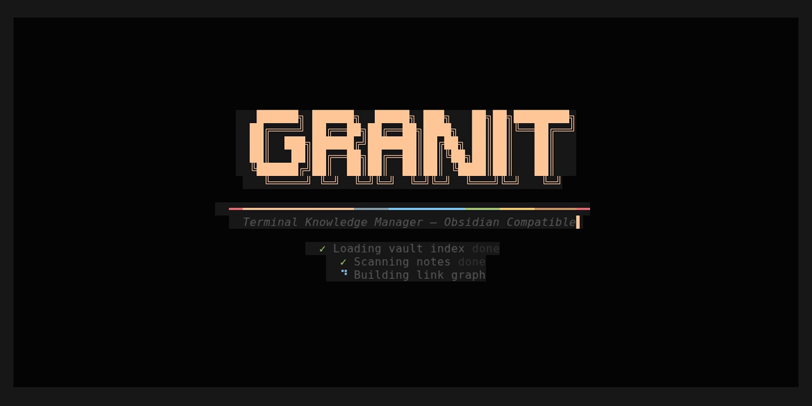
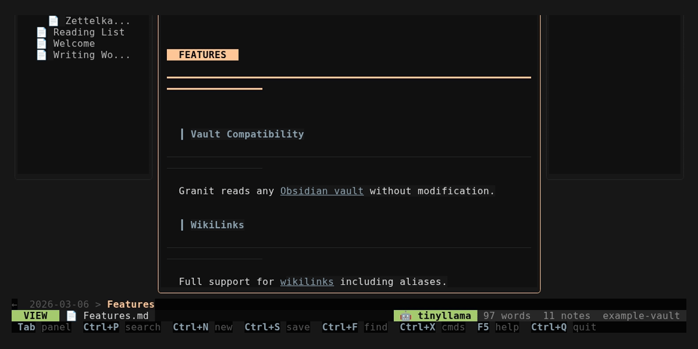
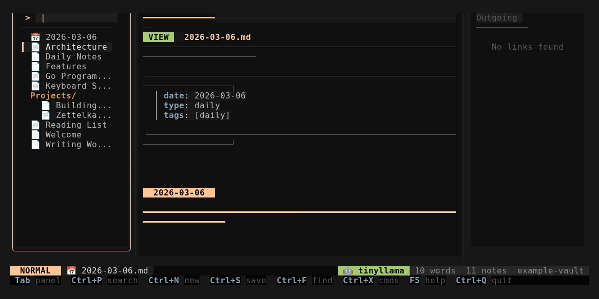

<p align="center">
  <pre align="center">
   ██████╗ ██████╗  █████╗ ███╗   ██╗██╗████████╗
  ██╔════╝ ██╔══██╗██╔══██╗████╗  ██║██║╚══██╔══╝
  ██║  ███╗██████╔╝███████║██╔██╗ ██║██║   ██║
  ██║   ██║██╔══██╗██╔══██║██║╚██╗██║██║   ██║
  ╚██████╔╝██║  ██║██║  ██║██║ ╚████║██║   ██║
   ╚═════╝ ╚═╝  ╚═╝╚═╝  ╚═╝╚═╝  ╚═══╝╚═╝   ╚═╝
  </pre>
</p>

<p align="center">
  <strong>A blazing-fast, AI-powered terminal knowledge manager — fully Obsidian compatible</strong>
</p>

<p align="center">
  <a href="#installation"></a>
  <a href="LICENSE"></a>
  
  
</p>

<p align="center">
  <a href="#features">Features</a> •
  <a href="#installation">Installation</a> •
  <a href="#quick-start">Quick Start</a> •
  <a href="#ai-features">AI Features</a> •
  <a href="#keyboard-shortcuts">Shortcuts</a> •
  <a href="#configuration">Config</a> •
  <a href="#themes">Themes</a> •
  <a href="#contributing">Contributing</a>
</p>

<p align="center">
  
</p>

---

Granit is a **free, open-source** terminal-native personal knowledge management system built in Go. It reads and writes standard Markdown with YAML frontmatter and `[[wikilinks]]`, so your vault stays **fully compatible** with Obsidian, Logseq, and any other Markdown-based tool.

**No Electron. No browser. No subscriptions. Just your terminal.**

> **Why Granit?** Obsidian is great, but it's Electron-based, closed-source, and its AI features require a paid subscription. Granit gives you a fast, keyboard-driven alternative with **built-in AI** (local or cloud), **Vim keybindings**, **Git integration**, and **100+ features** — all running natively in your terminal at a fraction of the memory footprint.

---

## Screenshots

<table>
<tr>
<td align="center"><strong>Splash Screen</strong></td>
<td align="center"><strong>Rendered View Mode</strong></td>
</tr>
<tr>
<td></td>
<td></td>
</tr>
<tr>
<td align="center"><strong>3-Panel Editor Layout</strong></td>
<td align="center"><strong>Sidebar + Backlinks</strong></td>
</tr>
<tr>
<td></td>
<td></td>
</tr>
</table>

---

## Features

### Core Editor

- **Syntax-highlighted Markdown** — headings, bold, italic, code blocks, blockquotes, lists, checkboxes
- **Language-aware code highlighting** — fenced code blocks colored per language (Go, Python, JS/TS, Rust, Shell) with keyword, type, string, comment, and number styling
- **Wikilinks** — `[[note]]` linking with automatic resolution across the vault
- **Backlinks panel** — see every note that links to the current one, plus outgoing links
- **Live backlink preview** — floating popup showing linked note content when cursor is on a `[[wikilink]]`
- **YAML frontmatter** — parsing and display of tags, dates, and custom fields
- **Frontmatter editor** — structured overlay for editing properties (tags as pills, booleans as toggles, dates with validation, presets)
- **Rendered view mode** — toggle between raw edit and styled reading with `Ctrl+E`
- **Vim keybindings** — full modal editing (Normal/Insert/Visual/Command) with `hjkl`, `dd`/`yy`/`p`, `:w`/`:q`, dot repeat
- **Multi-cursor editing** — `Ctrl+D` to select word and add cursors at next occurrence
- **Undo/Redo** — full edit history (`Ctrl+U` / `Ctrl+Y`)
- **Find & Replace** — `Ctrl+F` / `Ctrl+H` with match highlighting
- **Smart autocomplete** — inline wikilink popup triggered by `[[` with fuzzy search and preview snippets
- **Collapsible sections** — fold/unfold headings and code blocks with fold indicators (`▶`/`▼`)
- **Footnotes** — `[^id]` references with styled markers and definition lookup
- **Auto-close brackets** and smart indentation
- **Line numbers** with active line highlighting
- **Snippet expansion** — 18 built-in snippets (`/date`, `/todo`, `/meeting`, `/table`, etc.)
- **Spell checking** — integrated aspell/hunspell support
- **Focus/Zen mode** — distraction-free writing with `Ctrl+Z`
- **Ghost Writer** — inline AI writing suggestions (Tab to accept)
- **Visual table editor** — edit Markdown tables in a spreadsheet-like interface
- **Mermaid diagrams** — ASCII rendering of flowcharts, sequence diagrams, pie charts, class diagrams, and Gantt charts in view mode
- **Custom diagrams** — `diagram` code blocks with 6 types: sequence (combos/flows), tree (decisions), movement (footwork grids), timeline, comparison tables, and figure (pre-drawn fighting technique illustrations with 10 poses)
- **Global search & replace** — find and replace text across all vault files with preview, per-file or vault-wide replacement
- **Link assistant** — find unlinked mentions of other notes and batch-create `[[wikilinks]]`
- **Tab reordering** — drag tabs with `Alt+Shift+Left/Right`, close with `Alt+W`
- **Note encryption** — AES-256-GCM encryption with PBKDF2 key derivation for secure GitHub sync (`.md.enc` files)
- **Language learning** — vocabulary tracker (9 languages), spaced repetition practice, grammar notes, dashboard with streaks and level charts
- **Habit & goal tracker** — daily habits with streak visualization, goals with milestones and progress bars, completion stats
- **Focus sessions** — guided work timer (25/45/60/90 min), goal setting, scratchpad, break timer, session logs in `FocusSessions/`
- **Daily standup generator** — auto-generates standup from git commits, modified notes, completed tasks; saves to `Standups/`
- **Note versioning timeline** — git history per note with visual timeline, colored diff viewer, and snapshot at any commit
- **Smart connections** — TF-IDF content similarity finds semantically related notes with shared keyword display
- **Writing statistics** — word count tracking, 14-day activity chart, writing streaks, top notes by length
- **Quick capture** — compact floating input to quickly save thoughts to Inbox, daily note, Tasks, or new note
- **Vault dashboard** — home screen with today's tasks, recent notes, vault stats, writing streaks, 7-day activity chart
- **Enhanced calendar** — year view, 14-day agenda, task badges, quick event add, week numbers
- **Mind map view** — ASCII mind map from note headings and wikilinks, headings + links modes
- **Daily journal prompts** — 100+ prompts across 8 categories with guided write mode
- **Clipboard manager** — 50-entry history with search, pin, preview, and paste
- **Daily planner** — time-blocked daily schedule (6am–10pm, 30-min slots) with task/event/habit sync, progress bar, focus session launch
- **AI smart scheduler** — AI-powered optimal schedule generation with priority ordering, break insertion, estimated times, Ollama/OpenAI/local fallback
- **Core plugins** — enable/disable 16 built-in modules via Settings > Core Plugins

### AI-Powered Features

Granit includes **18 AI features** that work with local models (Ollama), OpenAI, or a zero-setup offline fallback:

| Feature | Description |
|---------|-------------|
| **9 AI Bots** | Auto-Tagger, Link Suggester, Summarizer, Q&A, Writing Assistant, Title Suggester, Action Items, MOC Generator, Daily Digest |
| **AI Chat** | Ask questions about your entire vault with context-aware answers |
| **Chat with Note** | AI Q&A focused on the current note |
| **AI Compose** | Generate full notes from a topic prompt |
| **Ghost Writer** | Inline writing suggestions as you type |
| **Thread Weaver** | Synthesize multiple notes into a new essay or summary |
| **Semantic Search** | AI-powered meaning-based vault search using embeddings |
| **Knowledge Graph AI** | Analyze clusters, hubs, orphan notes, and get link suggestions |
| **Auto-Link** | Find unlinked mentions of note titles in your text |
| **Auto-Tag** | Automatically suggest tags on save |
| **Similar Notes** | TF-IDF cosine similarity to find related notes |
| **AI Template Generator** | 9 template types (meeting, project, tech doc, blog, tutorial, comparison, summary, workout, custom) with AI generation |
| **Deep Dive Research** | Research any topic via Claude Code — 4 profiles (general/academic/technical/creative), 4 source filters, research log |
| **Vault Analyzer** | AI analysis of vault structure, gaps, orphans, and improvement suggestions via Claude Code |
| **Note Enhancer** | AI-enhance current note with wikilinks, better structure, and deeper content via Claude Code |
| **Daily Digest** | Generate weekly review from recent vault activity via Claude Code |
| **Vault Refactor** | AI-powered suggestions to reorganize, merge, split, or retag notes |
| **Daily Briefing** | AI-generated morning summary of recent notes, tasks, and connections |
| **Quiz Mode** | Auto-generated quizzes from your notes for active recall |
| **Flashcards** | Spaced repetition study (SM-2 algorithm) extracted from your notes |
| **Learning Dashboard** | Track study progress, streaks, and mastery |

### Vault Management

- **Multi-vault switcher** — switch between vaults without restarting, manage vault list in-app
- **Vault selector** — pick from recent vaults or create new ones when launching `granit` without arguments
- **File tree sidebar** with folder expand/collapse and file icons
- **Fuzzy search** (`Ctrl+P`) across all notes
- **Full-text search** — search across all note contents with highlighted results
- **Tag browser** (`Ctrl+T`) — browse and filter notes by tag
- **Graph view** (`Ctrl+G`) — visualize note connections
- **Task manager** (`Ctrl+K`) — comprehensive task system with 6 views (Today, Upcoming, All, Done, Calendar, **Kanban board**), 5 priority levels (`🔺⏫🔼🔽`), due dates with date picker shortcuts, dedicated `Tasks.md` storage, source file badges, and cross-vault task scanning from all notes
- **Calendar view** (`Ctrl+L`) — month, week, and agenda views tied to daily notes
- **Timeline view** — chronological visualization of all notes grouped by day, week, or month
- **Bookmarks & recents** (`Ctrl+B`) — star notes and jump to recently opened files
- **Quick switch** (`Ctrl+J`) — fast switching among recent notes
- **Note outline** (`Ctrl+O`) — heading-based document outline
- **Workspace layouts** — save and restore named workspace snapshots (open tabs, layout, view mode)
- **Breadcrumb navigation** — folder-path breadcrumb above the editor (`vault > folder > note`), `Alt+Left`/`Alt+Right` for browser-style back/forward, pinned tabs
- **Daily notes** — create or open today's note with a single command
- **Vault statistics** — note counts, link density, word counts
- **Trash** — soft-delete with restore
- **Folder management** — create folders and move files
- **File watcher** — auto-detects external changes and refreshes the vault
- **Lazy vault loading** — on-demand content reading for fast startup with large vaults (1000+ notes)
- **Pomodoro timer** — 25-min focus sessions with break cycles, writing stats tracking
- **System clipboard** — `Ctrl+V` paste with platform-native clipboard access
- **Web clipper** — fetch a URL, convert to Markdown, save as a note

### Git Integration

Built-in git overlay with three views:

- **Status** — modified, added, deleted, and untracked files
- **Log** — recent commit history with colored hashes
- **Diff** — syntax-highlighted diff of unstaged changes
- Quick actions: **commit** (c), **push** (p), **pull** (P), **refresh** (r)
- **Auto-sync** — optional auto commit+push on save, pull on open
- **Per-note git history** — view commit history, browse colored diffs, and restore previous versions for any note

### Export & Publishing

- **Export to HTML** — styled document with CSS
- **Export to Plain Text** — Markdown stripped to plain text
- **Export to PDF** — via pandoc (if installed)
- **Bulk HTML export** — all vault notes at once
- **Static site publisher** — export your vault as a complete HTML website with search, tag pages, and wikilink resolution
- **Blog publisher** — publish notes to **Medium** (draft/public/unlisted with tag extraction) or **GitHub** (push Markdown to any repo/branch)

### Extensibility

- **Plugin system** — language-agnostic scripts with JSON manifests, 6 built-in plugins
- **Lua scripting** — full API access to vault operations (`granit.read_note`, `granit.write_note`, etc.)
- **Dataview queries** — embed live queries in notes using `query` code blocks
- **Obsidian import** — import settings from existing `.obsidian/` directories
- **Canvas / Whiteboard** — visual note arrangement with connections and colors
- **Split panes** — view two notes side by side

### 28+ Themes, Custom Themes & 4 Icon Sets

Instantly switch between **22 dark** and **6 light** built-in themes from settings. Create your own with the **Theme Editor** — live-edit all 16 color roles with hex values, preview changes instantly, and save/export custom themes as JSON. Choose from **Unicode**, **Nerd Font**, **Emoji**, or **ASCII** icon sets.

### 5 Panel Layouts

- **Default** — 3-panel: sidebar + editor + backlinks
- **Writer** — 2-panel: sidebar + editor
- **Minimal** — editor only
- **Reading** — editor + backlinks, no sidebar
- **Dashboard** — 4-panel: sidebar + editor + outline + backlinks

### Image Manager

Browse, preview, insert, and delete images in your vault. Terminal image preview uses half-block character rendering for truecolor terminals.

### 10+ Note Templates

Create notes from built-in templates: Standard, Meeting Notes, Project Plan, Weekly Review, Book Notes, Decision Record, Journal Entry, Research Note, Learning/Zettelkasten, and more. **User-defined templates** are also supported — drop `.md` files into your vault's `templates/` folder and they appear in the template picker.

---

## Installation

### Requirements

- **Go 1.23+** ([install Go](https://go.dev/doc/install))
- **Git** (for cloning and git features)
- Linux or macOS (Windows support planned)

### Quick Install (Recommended)

```bash
git clone https://github.com/artaeon/granit.git
cd granit
go install ./cmd/granit/
```

This installs the `granit` binary to `~/go/bin/`. Make sure it's in your PATH:

```bash
# Add to ~/.bashrc or ~/.zshrc (one-time setup):
export PATH="$HOME/go/bin:$PATH"

# Then reload:
source ~/.bashrc  # or source ~/.zshrc
```

### System-wide Install

```bash
git clone https://github.com/artaeon/granit.git
cd granit
go build -o granit ./cmd/granit
sudo mv granit /usr/local/bin/
```

### Go Install (Remote)

```bash
go install github.com/artaeon/granit/cmd/granit@latest
```

### Updating

```bash
cd granit
git pull
go install ./cmd/granit/
```

### Optional Dependencies

| Tool | Purpose | Required? |
|------|---------|-----------|
| **Ollama** | Local AI (recommended) | No — local fallback works offline |
| **aspell** or **hunspell** | Spell checking | No |
| **pandoc** | PDF export | No |
| **xclip**, **xsel**, or **wl-copy** | System clipboard (Linux) | No — clipboard features degrade gracefully |
| **Claude Code** | Deep Dive AI research agent | No — only needed for research feature |
| **Git** | Version control features | No — git features are optional |

---

## Quick Start

```bash
# Open the vault selector (pick from recent vaults or create new):
granit

# Open a specific vault:
granit ~/Notes

# Open with explicit command:
granit open ~/Notes

# Create/open today's daily note:
granit daily ~/Notes

# Scan a vault and print stats:
granit scan ~/Notes

# List all known vaults:
granit list

# Show configuration paths and values:
granit config

# View the man page:
granit man | man -l -

# Print version:
granit version
```

### First Steps

1. Run `granit` in any directory with `.md` files — or create a new vault from the selector.
2. Use `Tab` or `F1`/`F2`/`F3` to switch between sidebar, editor, and backlinks.
3. Press `Ctrl+N` to create a new note (pick from 10 templates).
4. Type `[[` in the editor to start a wikilink — autocomplete suggests matching notes.
5. Press `Ctrl+E` to toggle between edit and rendered view mode.
6. Press `Ctrl+S` to save. Enable auto-save in settings (`Ctrl+,`).
7. Press `Ctrl+X` to open the **command palette** — access all 70+ commands from one place.

---

## AI Features

Granit supports three AI providers. The **local** provider works out of the box with no setup.

### Ollama (Recommended for Local AI)

Granit includes a **built-in setup wizard**. Open settings (`Ctrl+,`), select **"Setup Ollama"**, and press Enter. The wizard installs Ollama and pulls your chosen model automatically.

Or set up manually:

```bash
# Install Ollama
curl -fsSL https://ollama.ai/install.sh | sh

# Pull a model
ollama pull qwen2.5:0.5b

# Start the server
ollama serve
```

#### Model Recommendations

| RAM | Model | Quality |
|-----|-------|---------|
| 4 GB | `qwen2.5:0.5b` | Fast, lightweight |
| 8 GB | `qwen2.5:1.5b` or `phi3:mini` | Good balance |
| 16 GB | `qwen2.5:3b` or `phi3.5:3.8b` | High quality |
| 32 GB+ | `llama3.2` or `mistral` | Best quality |

When Granit exits, it automatically unloads the Ollama model to free memory.

### OpenAI

```json
{
  "ai_provider": "openai",
  "openai_key": "sk-...",
  "openai_model": "gpt-4o-mini"
}
```

Available models: `gpt-4o-mini`, `gpt-4o`, `gpt-4.1-mini`, `gpt-4.1-nano`.

### Claude Code (Deep Dive Research)

The **Deep Dive Research** feature uses [Claude Code](https://docs.anthropic.com/en/docs/claude-code) as an AI-powered research agent. When you give it a topic, it:

1. Searches the web for current information
2. Creates 5-25 interconnected notes in a `Research/` folder
3. Generates a hub note (`_Index.md`) linking everything
4. Adds frontmatter, tags, and `[[wikilinks]]` automatically

Three output formats: **Zettelkasten** (atomic notes), **Outline** (hierarchical), or **Study Guide** (with flashcard-ready Q&A). Research runs in the background with a live status bar indicator — keep editing while Claude works.

**Requires**: Claude Code installed and authenticated (`claude` in PATH). No API key configuration needed in Granit.

### Local Fallback

The default `"local"` provider uses keyword matching, stopword filtering, and topic detection — no network calls, no API keys, works offline.

---

## Keyboard Shortcuts

### Navigation

| Key | Action |
|-----|--------|
| `Tab` / `Shift+Tab` | Cycle between panels |
| `F1` / `F2` / `F3` | Focus sidebar / editor / backlinks |
| `Alt+Left` / `Alt+Right` | Navigate back / forward in history |
| `Esc` | Return to sidebar / close overlay |
| `j` / `k` / Arrows | Navigate up/down |
| `Enter` | Open selected file or link |

### File Operations

| Key | Action |
|-----|--------|
| `Ctrl+P` | Quick open (fuzzy search) |
| `Ctrl+N` | Create new note (template picker) |
| `Ctrl+S` | Save current note |
| `Ctrl+V` | Paste from system clipboard |
| `F4` | Rename current note |
| `Ctrl+X` | Command palette (all commands) |

### Editor

| Key | Action |
|-----|--------|
| `Ctrl+E` | Toggle view/edit mode |
| `Ctrl+U` / `Ctrl+Y` | Undo / Redo |
| `Ctrl+F` | Find in file |
| `Ctrl+H` | Find and replace |
| `Ctrl+D` | Select word / multi-cursor |
| `Ctrl+K` | Task manager |
| `[[` | Trigger wikilink autocomplete |
| `Tab` | Accept ghost writer suggestion / indent |

### Views & Tools

| Key | Action |
|-----|--------|
| `Ctrl+G` | Note graph |
| `Ctrl+T` | Tag browser |
| `Ctrl+O` | Note outline |
| `Ctrl+B` | Bookmarks & recent |
| `Ctrl+J` | Quick switch files |
| `Ctrl+W` | Canvas / whiteboard |
| `Ctrl+L` | Calendar view |
| `Ctrl+R` | AI bots |
| `Ctrl+Z` | Focus / zen mode |
| `Ctrl+,` | Settings |
| `F5` | Help / keyboard shortcuts |
| `Ctrl+Q` | Quit |

### Vim Mode

When enabled (settings or command palette), the editor uses full modal keybindings:

| Mode | Keys |
|------|------|
| **Normal** | `h`/`j`/`k`/`l`, `w`/`b`/`e`, `0`/`$`, `gg`/`G`, `dd`/`yy`/`p`, `u`/`Ctrl+R`, `i`/`a`/`o`/`O`, `.` repeat |
| **Insert** | All keys pass through; `Esc` returns to Normal |
| **Visual** | Movement extends selection; `d` deletes, `y` yanks |
| **Command** | `:w` save, `:q` quit, `:wq` save+quit, `:{n}` go to line |

---

## Configuration

Granit uses a layered JSON config:

| Scope | Path |
|-------|------|
| Global | `~/.config/granit/config.json` |
| Per-vault | `<vault>/.granit.json` |
| Vault list | `~/.config/granit/vaults.json` |

Per-vault settings override global. All settings can be changed from the built-in settings panel (`Ctrl+,`).

<details>
<summary><strong>All Configuration Options</strong></summary>

```json
{
  "editor": {
    "tab_size": 4,
    "insert_tabs": false,
    "auto_indent": true
  },
  "theme": "catppuccin-mocha",
  "icon_theme": "unicode",
  "layout": "default",
  "sidebar_position": "left",
  "show_icons": true,
  "show_help": true,
  "show_splash": true,
  "compact_mode": false,
  "line_numbers": true,
  "word_wrap": false,
  "highlight_current_line": true,
  "auto_close_brackets": true,
  "auto_save": false,
  "auto_refresh": true,
  "confirm_delete": true,
  "default_view_mode": false,
  "vim_mode": false,
  "ghost_writer": false,
  "auto_tag": false,
  "daily_notes_folder": "",
  "daily_note_template": "",
  "git_auto_sync": false,
  "ai_provider": "local",
  "ollama_model": "qwen2.5:0.5b",
  "ollama_url": "http://localhost:11434",
  "openai_key": "",
  "openai_model": "gpt-4o-mini"
}
```

| Option | Default | Description |
|--------|---------|-------------|
| `theme` | `catppuccin-mocha` | Color theme (28 available) |
| `icon_theme` | `unicode` | `unicode`, `nerd`, `emoji`, or `ascii` |
| `layout` | `default` | `default` (3-panel), `writer` (2-panel), `minimal` (editor only) |
| `vim_mode` | `false` | Enable Vim-style modal editing |
| `ghost_writer` | `false` | Enable inline AI writing suggestions |
| `auto_tag` | `false` | Auto-suggest tags on save |
| `git_auto_sync` | `false` | Auto commit+push on save, pull on open |
| `ai_provider` | `local` | `local`, `ollama`, or `openai` |

</details>

---

## Themes

### Dark Themes (22)

| Theme | Description |
|-------|-------------|
| `catppuccin-mocha` | Warm, pastel dark (default) |
| `catppuccin-frappe` | Mid-tone Catppuccin |
| `catppuccin-macchiato` | Deep Catppuccin |
| `tokyo-night` | Inspired by Tokyo at night |
| `gruvbox-dark` | Retro, earthy warm tones |
| `nord` | Arctic, cool blue palette |
| `dracula` | Classic dark with vivid accents |
| `solarized-dark` | Ethan Schoonover's dark palette |
| `rose-pine` | Muted, elegant dark |
| `everforest-dark` | Nature-inspired greens |
| `kanagawa` | Inspired by Hokusai |
| `one-dark` | Atom's iconic dark theme |
| `github-dark` | GitHub dark mode |
| `ayu-dark` | Minimal, deep dark |
| `palenight` | Material Design dark |
| `synthwave-84` | Neon retro synthwave |
| `nightfox` | Cool, refined dark |
| `vesper` | Warm amber on deep brown |
| `poimandres` | Cool teal and pastels |
| `moonlight` | Soft blue-purple moonlit |
| `vitesse-dark` | Minimal, modern green |
| `oxocarbon` | IBM Carbon-inspired |

### Light Themes (6)

| Theme | Description |
|-------|-------------|
| `catppuccin-latte` | Warm, pastel light |
| `solarized-light` | Ethan Schoonover's light |
| `rose-pine-dawn` | Elegant, warm light |
| `github-light` | GitHub light mode |
| `ayu-light` | Clean, bright light |
| `min-light` | Ultra-minimal bright |

---

## Architecture

```
granit/
  cmd/granit/
    main.go                 CLI entry point, vault selector, subcommands
    manpage.go              Roff man page generator (granit man)
  internal/
    config/
      config.go             JSON configuration (global + per-vault)
      vaults.go             Vault list persistence
      import.go             Obsidian config importer
    vault/
      vault.go              Vault scanning with lazy loading
      parser.go             Markdown/frontmatter/wikilink parser
      index.go              Backlink and link index
    tui/
      app.go                Main Bubble Tea model (~4800 lines)
      editor.go             Text editor with multi-cursor
      syntaxhl.go           Language-aware code block highlighting
      renderer.go           Markdown rendering for view mode
      sidebar.go            File tree sidebar
      statusbar.go          Status bar with AI, pomodoro, and task indicators
      styles.go             Global style definitions
      themes.go             28 built-in color themes
      customtheme.go        Custom theme JSON loading/saving
      themeeditor.go        Live theme editor overlay
      layouts.go            5 panel layout definitions
      command.go            Command palette (70+ actions)
      vim.go                Vim modal editing
      folding.go            Collapsible heading/code fold state
      footnotes.go          Footnote parsing and rendering
      encryption.go         AES-256-GCM note encryption
      frontmatteredit.go    Structured frontmatter property editor
      backlinkpreview.go    Live wikilink hover preview
      githistory.go         Per-note git history with diff/restore
      workspace.go          Named workspace layout persistence
      timeline.go           Chronological note timeline
      vaultswitch.go        In-app multi-vault switcher
      vaultselector.go      Vault selector full-screen UI
      bots.go               AI bot system (9 bots)
      aichat.go             Vault-wide AI chat
      composer.go           AI note composer
      ghostwriter.go        Inline AI writing suggestions
      threadweaver.go       Multi-note AI synthesis
      autotag.go            Auto-tagger + note chat
      embeddings.go         Semantic search with AI embeddings
      knowledgegraph.go     Knowledge graph analysis
      vaultrefactor.go      AI vault reorganization
      dailybriefing.go      AI morning briefing generator
      similarity.go         TF-IDF note similarity
      tableeditor.go        Visual markdown table editor
      mermaid.go            Mermaid diagram ASCII renderer
      flashcards.go         Spaced repetition (SM-2)
      quizmode.go           Auto-generated quizzes
      learndash.go          Learning dashboard
      git.go                Git integration overlay
      export.go             Note export (HTML, text, PDF)
      publish.go            Static site publisher
      plugins.go            Plugin system + registry
      lua.go                Lua scripting engine
      calendar.go           Calendar view (month/week/agenda)
      canvas.go             Visual whiteboard
      contentsearch.go      Full-text vault search
      imageview.go          Image manager + terminal preview
      research.go           Deep Dive AI research agent + vault analyzer, note enhancer, daily digest
      aitemplates.go        AI template generator (9 types, Ollama/OpenAI/local)
      languagelearn.go      Language learning (vocabulary, practice, grammar, dashboard)
      habits.go             Habit & goal tracker (daily habits, goals, stats)
      focussession.go       Focus sessions (timer, scratchpad, session log)
      standup.go            Daily standup generator (git, tasks, notes)
      notehistory.go        Note versioning timeline (git diff, snapshots)
      smartconnect.go       Smart connections (TF-IDF similarity engine)
      writingstats.go       Writing statistics (word counts, streaks, charts)
      quickcapture.go       Quick capture (floating input for rapid notes)
      dashboard.go          Vault dashboard home screen
      mindmap.go            Mind map view (ASCII tree from headings/links)
      journalprompts.go     Daily journal prompts (100+ across 8 categories)
      clipmanager.go        Clipboard manager (50-entry history with search)
      dailyplanner.go       Daily planner (time-blocked schedule with task/event sync)
      aischeduler.go        AI smart scheduler (Ollama/OpenAI/local algorithm)
      taskmanager.go        Task manager with kanban, calendar, priorities
      linkassist.go         Unlinked mention finder + batch linking
      blogpublish.go        Blog publisher (Medium + GitHub)
      breadcrumb.go         Breadcrumb navigation + pinned tabs
      diagrams.go           Custom diagram engine (6 types + figures)
      globalreplace.go      Global search & replace across vault
      ... and 20+ more components
```

Built on [Bubble Tea](https://github.com/charmbracelet/bubbletea) and [Lip Gloss](https://github.com/charmbracelet/lipgloss) by [Charm](https://charm.sh/).

---

## Contributing

Contributions are welcome! Granit is free and open-source software.

### Build & Run

```bash
git clone https://github.com/artaeon/granit.git
cd granit
go build -o granit ./cmd/granit
./granit ~/your-vault
```

### Development Guidelines

- All TUI components live in `internal/tui/` and follow Bubble Tea's `Model`/`Update`/`View` pattern
- Overlays use value receivers for `Update` and `View`, helper components use pointer receivers
- Configuration goes in `internal/config/config.go` + `internal/tui/settings.go`
- Themes are `Theme` structs in `internal/tui/themes.go`
- Keep dependencies minimal (currently: Bubble Tea, Lip Gloss, GopherLua)

### Submitting Changes

1. Fork the repository and create a feature branch
2. Make your changes and verify `go build ./...` and `go vet ./...` pass
3. Open a pull request with a clear description

### Reporting Issues

Found a bug or have a feature request? [Open an issue](https://github.com/artaeon/granit/issues).

---

## License

Granit is released under the [MIT License](LICENSE). Free to use, modify, and distribute.

---

## Acknowledgments

- [Bubble Tea](https://github.com/charmbracelet/bubbletea) & [Lip Gloss](https://github.com/charmbracelet/lipgloss) — the terminal UI framework
- [Charm](https://charm.sh/) — the team behind the Go terminal ecosystem
- [Obsidian](https://obsidian.md/) — inspiration for vault-based knowledge management
- [Catppuccin](https://github.com/catppuccin/catppuccin) — the default color palette
- [GopherLua](https://github.com/yuin/gopher-lua) — Lua scripting support

---

<p align="center">
  <strong>Granit</strong> — your knowledge, your terminal, your rules.<br>
  <sub>Free and open source. No telemetry. No subscriptions. Your data stays local.</sub>
</p>
