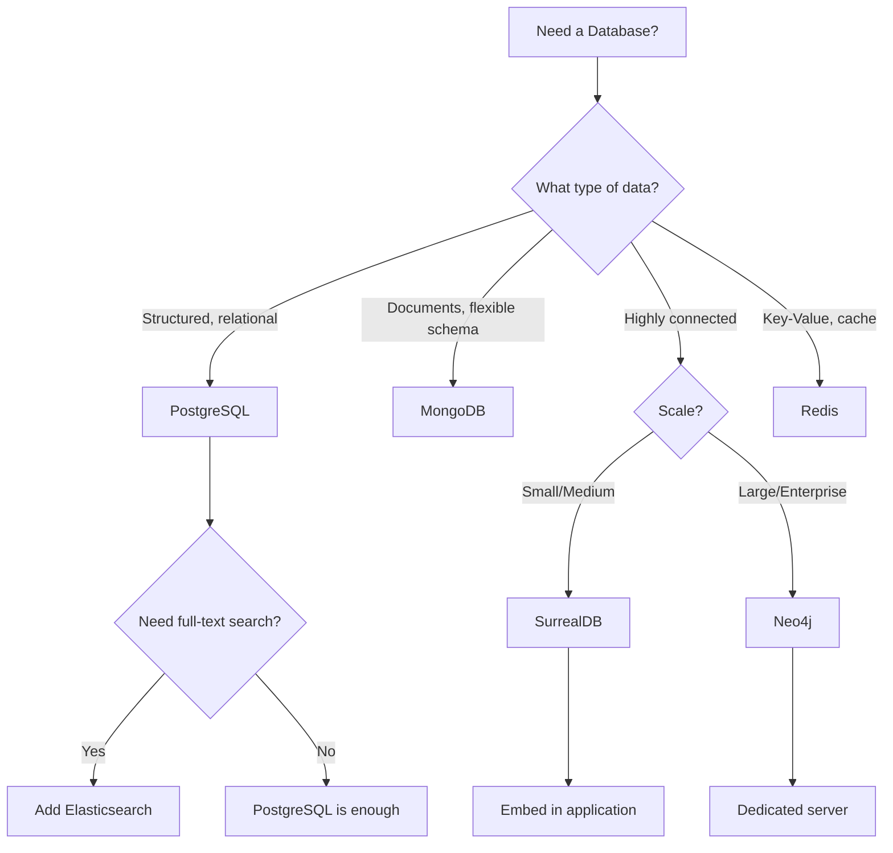
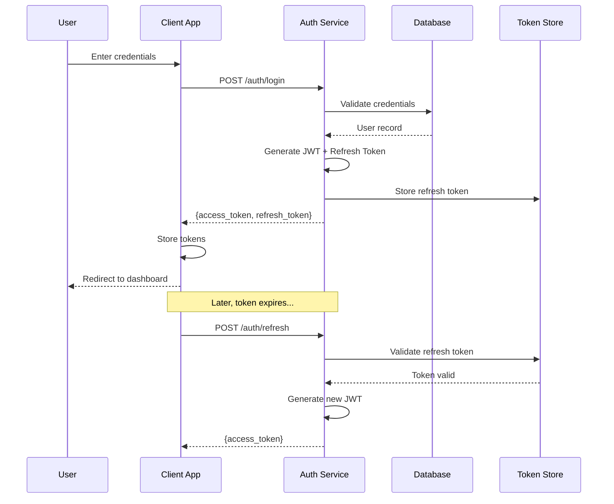
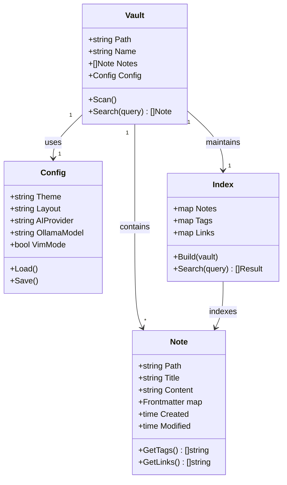
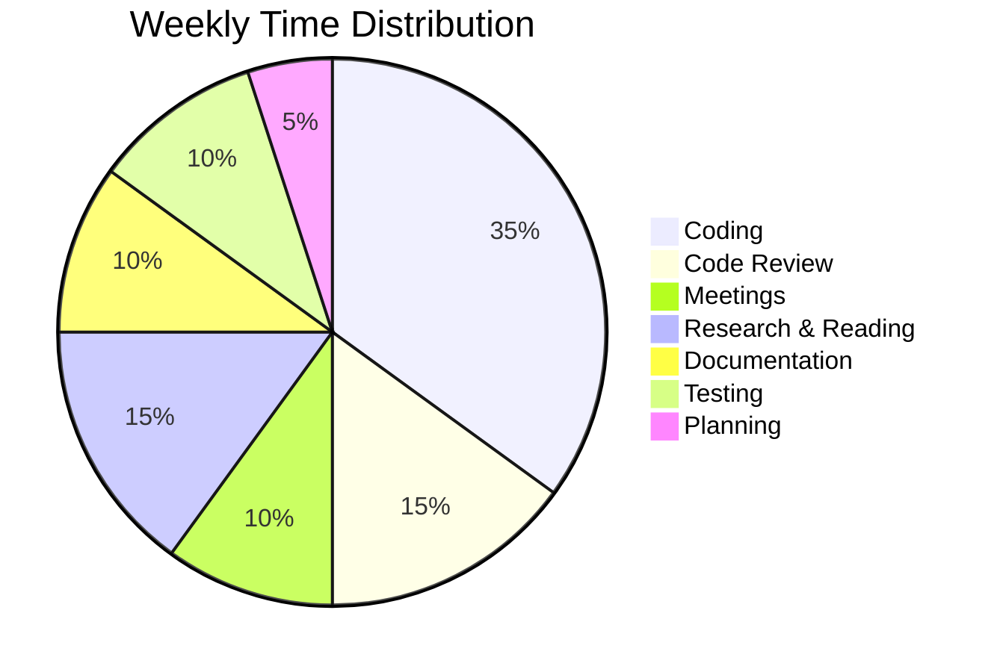
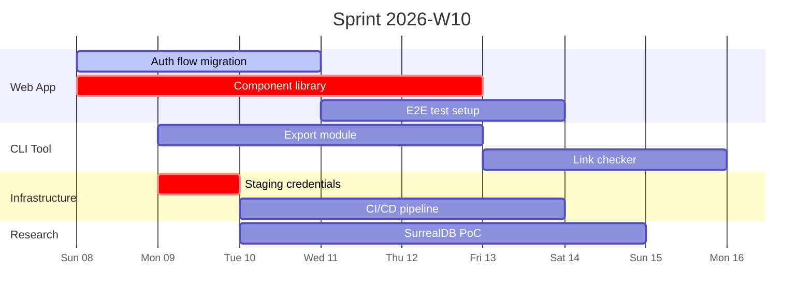
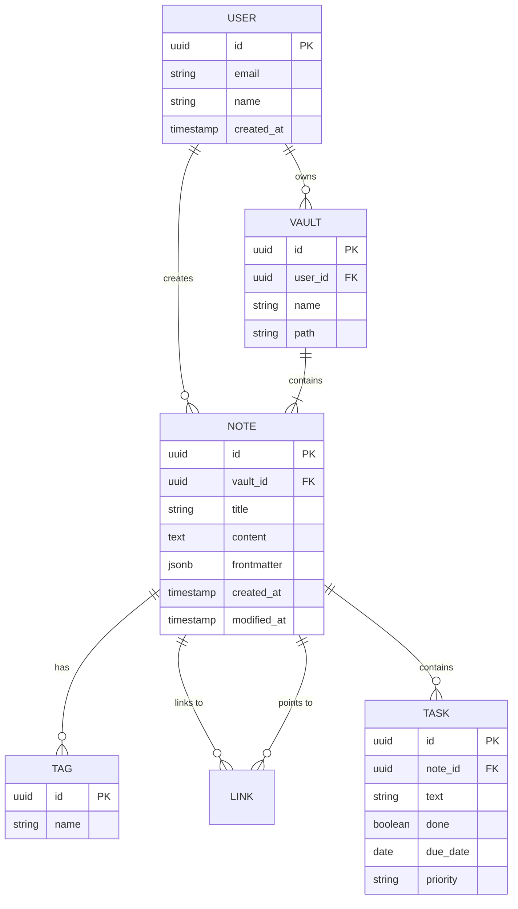

# Mermaid Diagram Examples

Granit supports rendering Mermaid diagrams in preview mode. This note showcases the most common diagram types. See [[Getting Started]] for how to toggle between edit and preview modes.

## Flowchart

A decision flow for choosing a database technology (related to [[Research/Graph Databases]]):



## Sequence Diagram

The authentication flow being rebuilt in [[Projects/Web App Redesign]]:



## Class Diagram

Granit's core data model:



## State Diagram

Editor mode transitions:

```mermaid
stateDiagram-v2
    [*] --> Normal : Open note
    Normal --> Insert : i, a, o
    Insert --> Normal : Esc
    Normal --> Visual : v
    Visual --> Normal : Esc
    Normal --> Command : :
    Command --> Normal : Enter/Esc
    Normal --> Search : /
    Search --> Normal : Enter/Esc

    state Normal {
        [*] --> Navigation
        Navigation --> Editing : d, c, y
        Editing --> Navigation : Complete
    }
```

## Pie Chart

Time distribution across this week's activities:



## Gantt Chart

Sprint timeline (see [[Tasks]] for details):



## Entity Relationship Diagram

Database schema for the web app:



## Tips for Writing Diagrams

1. Keep diagrams focused — one concept per diagram
2. Use descriptive labels, not single letters
3. Flowcharts work best for decision processes
4. Sequence diagrams are ideal for API interactions
5. Use `crit` in Gantt charts to highlight critical path items

---

*Related: [[Welcome]] | [[Meetings/Architecture Review]] | [[Projects/Web App Redesign]]*
