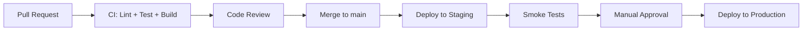

# Architecture Review — March 7, 2026

**Time:** 14:00 - 15:30 | **Location:** Conference Room B + Virtual | **Chair:** Alex

## Agenda

1. Frontend framework decision
2. Backend data layer evaluation
3. API versioning strategy
4. Deployment and CI/CD pipeline
5. Monitoring and observability

## Decision 1: Frontend Framework

**Decision:** React 19 with Server Components

**Alternatives considered:**
- SvelteKit — Excellent DX, but smaller ecosystem for enterprise components
- Next.js 15 — Too opinionated for our use case, vendor lock-in concerns
- Astro — Great for content sites, but we need heavy interactivity

**Rationale:** React 19's Server Components give us the SSR performance benefits without the complexity of a full meta-framework. The team already has React expertise, and the component ecosystem is unmatched.

> This decision directly impacts [[Projects/Web App Redesign]]. See that note for implementation details.

## Decision 2: Data Layer

**Decision:** PostgreSQL primary + SurrealDB for graph queries

Based on the research in [[Research/Graph Databases]], we evaluated four options. SurrealDB won for our use case because:

- Embeddable as a library (important for [[Projects/CLI Tool]])
- Multi-model: document + graph in one engine
- Written in Rust, excellent performance for our scale
- SurrealQL is intuitive for developers coming from SQL

```sql
-- Example: Find all notes connected to a topic within 2 hops
SELECT ->links_to->note->links_to->note
FROM note:welcome
FETCH title, tags;
```

**Risk mitigation:** Keep PostgreSQL as the primary data store. SurrealDB handles only graph traversal queries. If SurrealDB proves unstable, we can fall back to recursive CTEs in Postgres.

## Decision 3: API Versioning

**Decision:** URL path versioning (`/api/v1/`, `/api/v2/`)

| Strategy | Pros | Cons |
|----------|------|------|
| URL path | Simple, explicit, cacheable | URL pollution |
| Header | Clean URLs | Hard to test, proxy issues |
| Query param | Easy to add | Messy, easy to forget |
| Content negotiation | RESTful purity | Complex, poor tooling support |

URL path is the most pragmatic choice. It's easy to understand, easy to route, and well-supported by API gateways.

## Decision 4: CI/CD Pipeline

**Decision:** GitHub Actions with environment-based deployments



Key requirements:
- All PRs must pass lint, unit tests, and type checking
- Staging deploys are automatic on merge to `main`
- Production deploys require manual approval from two team members
- Rollback via Git revert, not infrastructure-level rollback

## Decision 5: Observability

**Decision:** OpenTelemetry + Grafana stack

- **Metrics:** Prometheus + Grafana dashboards
- **Logs:** Loki with structured JSON logging
- **Traces:** Tempo for distributed tracing
- **Alerts:** Grafana Alerting with PagerDuty integration

## Action Items

- [ ] Raphael: Spike on React Server Components with current API
- [ ] Sarah: Set up SurrealDB proof-of-concept with sample data
- [ ] Marcus: Draft CI/CD pipeline configuration
- [ ] Alex: Document ADRs (Architecture Decision Records) in the wiki

## Follow-Up

Next review scheduled for April 4, 2026. Focus will be on:
- SurrealDB PoC results
- Component library progress
- Performance benchmarks

---

*Related: [[Daily/2026-03-07]] | [[Research/Graph Databases]] | [[Projects/Web App Redesign]]*
