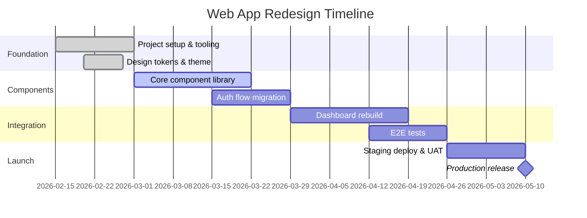

# Web App Redesign

**Status:** In Progress | **Target:** Q1 2026 | **Lead:** @raphael

A full redesign of the customer-facing web application. Moving from the legacy jQuery frontend to a modern React + TypeScript stack with a component library.

## Objectives

1. Migrate from jQuery to React 19 with TypeScript
2. Build a reusable component library with Storybook
3. Improve Lighthouse scores to 90+ across all categories
4. Reduce bundle size by 40% using code splitting and tree shaking
5. Implement proper accessibility (WCAG 2.1 AA)

## Architecture Decisions

After the [[Meetings/Architecture Review]], we decided on:

- **Framework:** React 19 with Server Components
- **Styling:** Tailwind CSS v4 + CSS Modules for complex components
- **State:** Zustand for client state, TanStack Query for server state
- **Testing:** Vitest + Playwright for E2E
- **Build:** Vite 6 with Rollup

> See [[Research/Graph Databases]] for the backend data layer evaluation that feeds into this project.

## Tasks

- [x] Audit current codebase and document component inventory
- [x] Set up new React project with Vite and TypeScript
- [x] Create design tokens and theme configuration
- [ ] Build core component library (Button, Input, Modal, Table)
- [ ] Migrate authentication flow to new stack
- [ ] Implement dashboard with real-time data widgets
- [ ] Set up Playwright E2E test suite
- [ ] Performance audit and optimization pass
- [ ] Accessibility review with screen reader testing
- [ ] Deploy to staging and run user acceptance testing

## Tech Stack Comparison

| Aspect | Legacy | New |
|--------|--------|-----|
| Framework | jQuery 3.6 | React 19 |
| Language | JavaScript | TypeScript 5.4 |
| Styling | Bootstrap 4 | Tailwind CSS v4 |
| Bundler | Webpack 4 | Vite 6 |
| Tests | Mocha + Selenium | Vitest + Playwright |
| Bundle Size | 2.1 MB | ~800 KB (target) |

## Key Resources

- Design mockups in Figma: `figma.com/file/abc123`
- [[Projects/CLI Tool]] — Shares the same API layer
- [[Ideas/Blog Post Ideas]] — Write-up planned about the migration process

## Notes

The migration needs to be incremental. We cannot do a big-bang rewrite. The plan is to use a micro-frontend approach during the transition period, where new React components are mounted alongside existing jQuery code.

```typescript
// Example: Mounting React component in legacy page
import { createRoot } from 'react-dom/client';
import { DashboardWidget } from '@/components/DashboardWidget';

const container = document.getElementById('react-widget-root');
if (container) {
  const root = createRoot(container);
  root.render(<DashboardWidget userId={currentUser.id} />);
}
```

## Timeline


