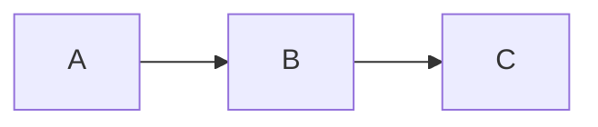

# Granit Publish — Static Site Generator

Publish any folder of markdown notes to a black-and-white static website.
Single binary, no Node.js, no React, no build step you don't control.
Output is plain HTML + one CSS file + a small vanilla-JS search shim —
deployable to GitHub Pages, Cloudflare Pages, fleetdeck, S3, or any
static-file host.

> Inspired by Obsidian Publish. Keeps the wikilink graph, backlinks,
> tag pages, and per-note outline; trades Obsidian's hosted service
> and live graph for a self-hosted, version-controllable, JS-free site
> you fully own.

---

## Table of contents

- [Quick start](#quick-start)
- [What gets generated](#what-gets-generated)
- [CLI reference](#cli-reference)
- [Configuration file](#configuration-file)
- [Frontmatter directives](#frontmatter-directives)
- [Wikilinks](#wikilinks)
- [Tags](#tags)
- [Graph view](#graph-view)
- [Search](#search)
- [SEO](#seo)
- [Mobile](#mobile)
- [Legal pages: Impressum / Datenschutz](#legal-pages-impressum--datenschutz)
- [Cookie banner](#cookie-banner)
- [Theming](#theming)
- [Deploy: GitHub Pages](#deploy-github-pages)
- [Deploy: fleetdeck / VPS](#deploy-fleetdeck--vps)
- [Deploy: Cloudflare Pages / Netlify / S3](#deploy-cloudflare-pages--netlify--s3)
- [Troubleshooting](#troubleshooting)

---

## Quick start

```bash
# Build a folder to ./dist
granit publish build ~/Notes/Research --title "Research"

# Build + open a local preview on http://localhost:8080
granit publish preview ~/Notes/Research

# Drop a config file (.granit/publish.json) you can hand-edit
granit publish init ~/Notes/Research
```

That's it. The output directory is fully self-contained and works at any
URL path (`yourname.github.io`, `yourname.github.io/repo/`, or a custom
domain).

---

## What gets generated

```
dist/
├── index.html              # homepage (homepage note OR auto note list)
├── notes/
│   └── <slug>.html         # one per published note
├── tags/
│   ├── index.html          # all tags with note counts
│   └── <tag-slug>.html     # all notes carrying that tag
├── graph.html              # force-directed SVG of the wikilink graph
├── style.css               # 4 KB B&W theme, light + dark via prefers-color-scheme
├── search.js               # ~30 lines of vanilla JS — fuzzy filter on the index
├── search-index.json       # title + first-800-chars body per note
└── .nojekyll               # tells GitHub Pages to serve files as-is
```

Total size for a 15-note folder with 60+ wikilinks: **~250 KB**. Build
time on a vault of 100 notes: under one second.

---

## CLI reference

```text
granit publish build [folder] [flags]     Render to ./dist (or --output)
granit publish preview [folder] [flags]   Build + serve on http://localhost:8080
granit publish init [folder]              Write .granit/publish.json template
granit publish help                       Show flag reference
```

### Flags

| Flag | Purpose | Default |
|---|---|---|
| `--output <dir>` / `-o` | Where to write the site | `./dist` |
| `--title <name>` | Site title (top-bar + `<title>`) | folder basename |
| `--homepage <file>` | Note (relative path) used as `index.html` | auto note list |
| `--site-url <url>` | Public root URL — enables canonical/og:url and absolute sitemap | unset (relative) |
| `--author <name>` | Sets `<meta name="author">` + JSON-LD author | unset |
| `--cookie-banner` | Emit a small bottom cookie banner | off |
| `--no-branding` | Hide the small "Built with Granit" link | branding shown |
| `--hero` | Use the hero homepage layout (big title + 3-col card grid) | list layout |
| `--auto-og` | Auto-generate a 1200×630 PNG og:image per note | off |
| `--og-image <path>` | Site-wide default og:image (relative path in source folder) | none |
| `--math` | Render LaTeX math via KaTeX (loaded from CDN, opt-in) | off |
| `--mermaid` | Render Mermaid diagram code blocks (loaded from CDN) | off |
| `--no-search` | Skip search index + JS shim | search enabled |
| `--config <path>` | Load config from this JSON file | `.granit/publish.json` next to source |

Positional argument is the source folder (defaults to `.`). All flags
accept both `--flag value` and `--flag=value` forms.

---

## Configuration file

The CLI looks for `.granit/publish.json` inside the source folder
unless `--config <path>` is passed. CLI flags override config-file
values; config-file values override defaults.

```json
{
  "siteTitle": "My Research Notes",
  "intro": "Public notes from my Energiegemeinschaften research, 2026.",
  "footer": "© 2026 — built with Granit",
  "lang": "en",
  "outputDir": "./docs",
  "homepage": "_Index.md",
  "siteURL": "https://notes.example.com",
  "author": "Jane Doe",
  "search": true,
  "cookieBanner": false,
  "cookieMessage": ""
}
```

| Field | Purpose |
|---|---|
| `siteTitle` | Header link + browser tab title |
| `intro` | Subtitle on the auto-generated index page (ignored when `homepage` is set) |
| `footer` | Plain-text footer (HTML support not yet) |
| `lang` | `<html lang>` attribute |
| `outputDir` | Where the site is written |
| `homepage` | Relative path of the note to use as `index.html` |
| `siteURL` | Public root URL (no trailing slash). Enables canonical, og:url, absolute sitemap |
| `author` | Site-wide default for `<meta name="author">` and JSON-LD author |
| `search` | `false` skips the search index + JS |
| `cookieBanner` | `true` emits a small bottom cookie banner on every page |
| `cookieMessage` | Override the default banner text. Use `{datenschutzURL}` placeholder if you want the link auto-substituted |
| `feedItems` | Cap on RSS feed item count. Default 50; set 0 for "include every published note" |

Generate a starter file with `granit publish init <folder>`.

---

## Frontmatter directives

Frontmatter is YAML between `---` markers at the top of the file.

```markdown
---
title: A clearer title than the filename
date: 2026-04-08
tags: [research, energy, austria]
publish: false
---

# Body starts here
```

| Field | Effect |
|---|---|
| `title` | Overrides the H1-or-filename fallback |
| `date` | Shown in the `meta` line under the title; also feeds index sort order (newest first) |
| `tags` | Array OR comma-separated string. Combined with inline `#tags` from the body |
| `author` | Per-note author (overrides the site-wide `--author` / config) |
| `publish: false` | Excludes this note from the published site even when its folder is published |
| `noindex: true` | Excludes from sitemap, emits `<meta name="robots" content="noindex,nofollow">` |
| `legal: impressum` | Renders this note at `/impressum.html` (root, not under `/notes/`) |
| `legal: datenschutz` | Renders this note at `/datenschutz.html` (root, not under `/notes/`) |

Notes with no frontmatter still publish — defaults are: title from first H1
or filename, date from file mtime, tags from inline `#tags`.

---

## Wikilinks

Granit's wikilink syntax (`[[Note Name]]` and `[[Note|display text]]`)
works exactly as it does inside the editor. Resolution rules:

1. Match by exact title (case-insensitive)
2. Match by filename (case-insensitive, no extension)
3. Match by slugified target

Unresolved targets render as plain text — no broken `<a>` link, no 404.
Search the published site to spot them quickly.

`[[Target#section]]` preserves the `#section` anchor on the resolved URL.

Each note's "Linked from" panel lists every other note that wikilinks to
it — automatically, no manual maintenance.

---

## Tags

Three sources, all merged:

- Frontmatter `tags: [...]` array
- Frontmatter `tags: a, b, c` comma string
- Inline `#tag` tokens in the body (alphanumeric + hyphen, must follow whitespace)

Each tag gets its own page at `/tags/<slug>.html` listing every note that
carries it. The full tag list lives at `/tags/index.html`.

---

## Graph view

`/graph.html` shows a force-directed SVG of the wikilink graph. Each note
is a node (radius scales with degree); each wikilink is an edge. The
layout is **deterministic** — same input produces the same SVG, so git
diffs of the published site stay tiny.

- Nodes are clickable (wrapped in `<a>`)
- Hover enlarges the node and emboldens its label
- Pure SVG + CSS, **no JavaScript**
- Skipped automatically when the folder has no edges (single-note site
  or no wikilinks) — the `Graph` link disappears from the nav

Algorithm: Fruchterman-Reingold, 200 iterations, seeded by node count
for reproducibility.

---

## Search

A small `search-index.json` (title + first 800 chars of body, per note)
is emitted alongside `search.js` (~30 lines of vanilla ES5). The search
input on the homepage filters in real-time as you type. No framework, no
bundler, no build step.

Disable with `--no-search` (saves ~5 KB on small sites).

---

## SEO

Every page emits a comprehensive head block:

- `<title>` and `<meta name="description">`
- `<link rel="canonical">` (absolute, when `siteURL` / `--site-url` is set)
- Open Graph: `og:title`, `og:description`, `og:type` (`article` for note
  pages, `website` everywhere else), `og:site_name`, `og:url`
- Twitter Card: `summary` variant with `twitter:title` + `twitter:description`
- `<meta name="author">` from per-note frontmatter, falling back to the
  site-wide `--author` flag / `author` config field
- `<meta name="robots" content="noindex,nofollow">` for legal pages and
  any note with `noindex: true` frontmatter
- **JSON-LD Article schema** on note pages — fed to Google/Bing for rich
  results. Includes `headline`, `datePublished`, `dateModified`, `author`,
  `publisher`, `description`, `url`, `mainEntityOfPage`

The build also drops:

- **`sitemap.xml`** — standards-conformant XML, lists every public page
  with last-modified dates. Uses absolute URLs when `siteURL` is set;
  falls back to path-only URLs otherwise (still valid, just less useful
  to crawlers).
- **`robots.txt`** — `User-agent: *` / `Allow: /` plus a `Sitemap:`
  directive when `siteURL` is set.

To turn off indexing for a single page, add `noindex: true` to its
frontmatter. To turn it off site-wide, set every page's `noindex` or
hand-edit `robots.txt` after build (granit only writes that file once
per build, so a custom version sticks if you delete `siteURL`).

---

## Mobile

The default theme is fully responsive without external CSS frameworks:

- `<meta name="viewport">` set to `width=device-width, initial-scale=1`
- Media queries at `≤640px` (small phone) and `≤380px` (very narrow):
  - Header navigation stacks vertically
  - Headings shrink (`h1` 2.1rem → 1.7rem → 1.5rem)
  - Padding tightens (3rem → 1.5rem → 1rem)
  - Prev/Next note nav stacks
  - Tags wrap onto multiple lines without overflowing
  - Search input grows to 16px font-size to prevent iOS zoom-on-focus
  - Cookie banner stacks button below text, full-width
- Tables in the note body get an internal scroll container
  (`overflow-x: auto`) so wide tables don't blow out the page width
- Graph SVG uses `viewBox` + `preserveAspectRatio` so it scales fluidly
  with `max-height: 80vh`
- `prefers-color-scheme: dark` flips the palette automatically

No JavaScript is involved in any of the responsive behaviour — pure CSS.

---

## Legal pages: Impressum / Datenschutz

For German / EU sites, granit auto-detects the two legal pages required
by §5 TMG (Germany) and §25 MedienG (Austria). When detected:

- The page is rendered to `/impressum.html` or `/datenschutz.html` at
  the **site root** (not under `/notes/`) so it has a clean, stable URL
- Footer links appear on every page automatically
- The page gets `<meta name="robots" content="noindex,nofollow">` so
  search engines don't index legal boilerplate
- It's excluded from the search index, the auto note list, and the
  graph

### Detection

Two paths, either is enough:

1. **Filename** (case-insensitive): `impressum.md`, `datenschutz.md`,
   `imprint.md` (English alias for impressum), `privacy.md` /
   `privacy-policy.md` (English aliases for datenschutz).
2. **Frontmatter**: `legal: impressum` or `legal: datenschutz` (also
   accepts `imprint` / `privacy` / `privacy-policy` as aliases).

### Cross-linking

If you wikilink to `[[Impressum]]` or `[[Datenschutz]]` from any other
note, the link automatically resolves to the root URL — your published
site stays self-consistent without you tracking which folder the legal
pages live in.

### Example minimal Impressum

```markdown
---
title: Impressum
legal: impressum
---

# Impressum

**Diensteanbieter:** Vorname Nachname, Straße 1, 1010 Wien
E-Mail: kontakt@example.com
```

---

## Cookie banner

The static site sets **no cookies by default** — there's nothing to
consent to. The banner is opt-in and intended for one of two cases:

1. You plan to add analytics (Plausible, Umami, Google) later
2. You want a visible compliance signal even on a cookieless site

Enable with `--cookie-banner` or `cookieBanner: true` in `publish.json`.
The banner:

- Appears fixed to the bottom of the page on first visit
- Has one button ("OK") that records dismissal in `localStorage`
- Auto-hides on subsequent visits
- Stacks vertically on mobile (≤640px)
- Uses the inverted color scheme (dark bar on light themes, light bar
  on dark themes) for contrast

### Customizing the message

Default English message: *"This site uses minimal cookies to remember
preferences. By using it, you agree."* — with a "See our Datenschutz"
link appended automatically when a Datenschutz page is detected.

Override via `cookieMessage` in `publish.json`:

```json
{
  "cookieBanner": true,
  "cookieMessage": "Diese Seite verwendet einen funktionalen localStorage-Eintrag. Mehr in der <a href=\"{datenschutzURL}\">Datenschutzerklärung</a>."
}
```

The `{datenschutzURL}` placeholder is substituted with the relative URL
to your detected Datenschutz page. HTML is permitted in the message.

### What the banner stores

Only one key: `granit-cookie-accepted=1` in `localStorage`. No tracking,
no fingerprinting, no third-party calls. The mention of "cookies" in the
default message is a slight misnomer (`localStorage` ≠ cookies under
strict GDPR reading) — adjust the message via `cookieMessage` if you
want to be technically precise.

---

## Theming

The default theme is in `internal/publish/style.go` and is intentionally
short — read it end-to-end before customizing. Highlights:

- Black on white, with `prefers-color-scheme: dark` flipping to white on
  near-black
- One serif-free system font stack (no web fonts → instant first paint)
- 720 px max content width, 1000 px when the page contains a graph or
  table (`:has()` selector — degrades gracefully on older browsers)
- Headings use letter-spacing -0.015em for the slight density that
  reads "publication" instead of "blog post"

To customize: drop your own `theme.css` next to the source folder
(planned override hook) or edit the generated `style.css` after build.
For repeatable builds, keep the override CSS under version control and
copy it after each `granit publish build`.

CSS variables you can override at the top of any sheet:

```css
:root {
  --bg: #fff;          /* page background */
  --fg: #111;          /* primary text */
  --muted: #666;       /* secondary text, meta lines */
  --rule: #e5e5e5;     /* hairline borders */
  --code-bg: #f6f6f6;  /* code blocks + inline code */
  --max: 720px;        /* content width */
}
```

---

## Deploy: GitHub Pages

The fastest path. Granit emits a `.nojekyll` file so files starting with
`_` (e.g. `_Index.md` slugged to `_index.html`) work correctly without
the legacy Jekyll preprocessing step.

```bash
# In a repo that will host the site
cd ~/your-repo

# Build into ./docs (the conventional Pages folder)
granit publish build ~/Notes/Research \
  --output ./docs \
  --title "Research" \
  --homepage README.md

git add docs/ && git commit -m "publish notes"
git push

# Repo Settings → Pages →
#   Source: Deploy from a branch
#   Branch: main / docs
```

The site is live at `https://<user>.github.io/<repo>/` within a minute.

### Custom domain

Add a `CNAME` file next to your `index.html` (in `docs/`):

```bash
echo "notes.example.com" > docs/CNAME
git add docs/CNAME && git commit -m "custom domain" && git push
```

Configure the DNS A record / CNAME at your domain registrar to point at
GitHub Pages, then enable the custom domain in repo settings.

### Auto-rebuild via GitHub Actions

```yaml
# .github/workflows/publish.yml
name: Publish notes
on:
  push:
    branches: [main]
jobs:
  build:
    runs-on: ubuntu-latest
    steps:
      - uses: actions/checkout@v4
      - uses: actions/setup-go@v5
        with: { go-version: '1.22' }
      - run: go install github.com/Artaeon/granit/cmd/granit@latest
      - run: granit publish build ./Notes --output ./public
      - uses: actions/upload-pages-artifact@v3
        with: { path: ./public }
  deploy:
    needs: build
    permissions: { pages: write, id-token: write }
    environment: { name: github-pages, url: ${{ steps.deployment.outputs.page_url }} }
    runs-on: ubuntu-latest
    steps:
      - id: deployment
        uses: actions/deploy-pages@v4
```

This way you commit your raw markdown — the action rebuilds and
publishes on every push.

---

## Deploy: fleetdeck / VPS

[FleetDeck](https://github.com/Artaeon/fleetdeck) deploys static files
behind Traefik with HTTPS in one command. No Docker config to write.

```bash
granit publish build ~/Notes --output ./dist
fleetdeck deploy ./dist \
  --server root@vps.example.com \
  --domain notes.example.com \
  --profile static
```

For repeated publishes: wrap both commands in a `publish.sh` and put it
on a cron / git post-push hook.

---

## Deploy: Cloudflare Pages / Netlify / S3

The output is plain static files — drop `dist/` into:

| Host | Command |
|---|---|
| **Cloudflare Pages** | `npx wrangler pages deploy ./dist` |
| **Netlify** | `netlify deploy --prod --dir ./dist` |
| **AWS S3** | `aws s3 sync ./dist s3://my-bucket --delete` |
| **Vercel** | `vercel deploy ./dist --prod` |
| **rsync / scp** | `rsync -avz --delete ./dist/ user@host:/var/www/notes/` |

No special configuration — every link is relative, every asset is local.

---

## Image assets

Any non-markdown file in the source folder (PNG, JPG, GIF, WEBP, SVG,
PDF, mp4, mp3, zip, etc.) gets copied to the output directory preserving
its relative path. Markdown image references with relative paths
(`` or ``) are auto-rewritten
during publish so they resolve from the published note's URL.

Hidden directories (`.git`, `.granit`, `.obsidian`), folders starting
with `_`, and macOS / Office temp files (`.DS_Store`, `~$...`) are
skipped.

Absolute URLs (`http://`, `https://`, `data:`, `//`) and root-relative
paths (`/foo.png`) are left alone.

---

## RSS feed

Granit always writes `feed.xml` (RSS 2.0) at the site root. The 50
most-recent non-legal, non-noindex notes appear as `<item>` entries
with title, link, description (first ~280 chars), `pubDate` (from
frontmatter `date:` or file mtime), author, and tag categories. The
cap is configurable — set `feedItems` in `publish.json` (or 0 for
"include everything").

Each page emits a `<link rel="alternate" type="application/rss+xml">`
tag in the head so RSS readers (Feedly, Inoreader, NetNewsWire) can
auto-discover the feed. Use the absolute feed URL when configuring
custom-domain readers:

```
https://your-site.example.com/feed.xml
```

---

## OG (Open Graph) images

Per-page social-media preview images, with three resolution paths in
priority order:

1. **Per-note frontmatter `image:`** — relative path to an image file
   in the source folder. Best quality control.
2. **Site-wide `--og-image` / `defaultOGImage`** — fallback when a note
   has no frontmatter image.
3. **Auto-generated via `--auto-og`** — granit rasterizes a 1200×630
   PNG per note: white background, black 1px border, site title at top
   left, note title centred and word-wrapped, "Built with Granit"
   bottom-right. Uses the embedded Go font (no external font files).

Auto-generated images live at `/og/<slug>.png` (~40 KB each).

The base template emits the full set of social-share meta tags whenever
an `og:image` is set:

```html
<meta property="og:image" content="...">
<meta property="og:image:type" content="image/png">
<meta property="og:image:width" content="1200">
<meta property="og:image:height" content="630">
<meta name="twitter:card" content="summary_large_image">
<meta name="twitter:image" content="...">
```

---

## Math (KaTeX)

Opt in with `--math` or `math: true` in `publish.json`. Granit detects
inline `$...$` and display `$$...$$` math spans during rendering and
only injects the KaTeX CSS + JS on pages that contain math — every other
page stays JavaScript-free. KaTeX is loaded from `cdn.jsdelivr.net` with
SHA-384 subresource integrity hashes pinned.

Math rendering is client-side; the markdown source stays as plain `$x^2$`
and `$$\int_0^1 x \, dx$$` syntax.

---

## Mermaid diagrams

Opt in with `--mermaid` or `mermaid: true` in `publish.json`. Triple-
backtick fenced blocks tagged `mermaid` get rendered as flowcharts /
sequence diagrams / Gantt charts in the browser:

````markdown

````

Granit detects the fenced block and only loads `mermaid.esm.min.mjs`
from `cdn.jsdelivr.net` on pages that contain at least one diagram.
Theme is set to `neutral` (B&W-friendly).

---

## 404 page

Always emitted. GitHub Pages, Netlify, Cloudflare Pages, and most
static hosts serve `404.html` automatically when a request misses any
known file. The default 404 template carries the site nav + a link
back to the index, and is `noindex,nofollow` so search engines don't
list it.

---

## Hero homepage layout

By default the index page is a dense vertical list of notes. Switch to
a centred-hero layout with `--hero` or `homepageStyle: "hero"`:

- Centred large title block + intro
- Inline search input (when search is enabled)
- 3-column note grid (auto-fills, 240 px min cards)
- Cards stack to 1 column on mobile

Looks more like a landing page; useful when the published folder
represents a project rather than a journal.

---

## Reading time

Note pages with at least 100 words show a small "N min read" chip in
the meta line below the title. Estimate uses 220 wpm. Notes shorter
than 100 words get no chip — a "1 min read" on a 30-word note feels
silly.

---

## Troubleshooting

### "publish: no notes found under ..."

The folder has no `.md` files at any depth (or all of them carry
`publish: false`). Check with `ls **/*.md` and verify the path argument.

### Wikilinks render as plain text

The target note isn't in the published set. Either:
- It's outside the source folder
- It has `publish: false` in its frontmatter
- The link target doesn't match any note's title, filename, or slug

### Pages folder shows "404 — File not found"

Most common cause: GitHub Pages was set to a branch but no `index.html`
exists at the configured path. Verify `docs/index.html` exists after the
build, and that Pages source matches the folder you used as `--output`.

### Files starting with `_` not served

`.nojekyll` is dropped in the output folder by every build — but if
you've added a `.gitignore` rule excluding dotfiles, git may not be
committing it. Confirm with `git ls-files docs/.nojekyll`.

### Code blocks aren't highlighted

Highlighting uses chroma's `bw` style (intentional — no color in the B&W
theme). Bold/italic distinguishes keywords and strings. To use a colorful
style, you'd modify `internal/publish/build.go` (`highlighting.WithStyle`)
and rebuild granit.

### Want a sidebar with all notes?

Not in the default templates yet — the design intentionally privileges
the article. Workaround: use the auto-generated index page (drop
`--homepage`) which lists every note. A "left sidebar" template variant
is on the roadmap.

---

## Roadmap

- [ ] Custom template overrides via `.granit/publish/templates/*.html`
- [ ] Theme override via `.granit/publish/theme.css`
- [ ] Math rendering (KaTeX, opt-in to keep payload small)
- [ ] Mermaid diagrams (opt-in)
- [ ] Image asset copying (currently inline-only)
- [ ] `granit publish deploy` integrating fleetdeck directly
- [ ] Per-folder homepage variants (sidebar layout, full-width layout)

Open an issue or PR if you'd like any of these prioritized.
